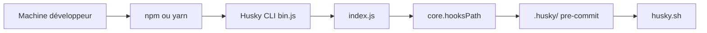

# typicode/husky

> Outil npm qui simplifie l'installation de hooks Git natifs dans un projet.

## Le problème
Faire exécuter des vérifications (lint, tests) avant chaque commit exige de gérer des hooks Git qui ne sont pas versionnés.

## Ce que ça fait vraiment
Le README ne contient qu'une adresse ; la suite vient de l'architecture d'après le code. Husky s'appuie sur le réglage Git `core.hooksPath` pour pointer vers un dossier `.husky/` versionné. Le CLI (`bin.js`) délègue à un module (`index.js`), et des scripts shell exécutent les hooks. Zéro dépendance, tests d'intégration en scripts shell.

## Comment c'est branché

## Essayer
Aucune commande documentée dans le README (une seule adresse vers https://typicode.github.io/husky).

## Coût et pièges
Gratuit. Demande Node et Git. Le dernier push date de mars 2026 ; 107 issues ouvertes. Matière insuffisante ici pour détailler l'usage : lire le site de documentation.

## Ce que ce n'est pas
Ce n'est pas un outil de lint ou de test : il ne fait que déclencher ce que tu lui indiques au moment des événements Git.

## Alternatives
Aucune alternative nommée dans le README.

## Pour toi
À surveiller : pratique pour imposer lint et tests avant commit dans un dépôt JavaScript ; hors du cœur data/IA, et à vérifier sur le site officiel puisque le README est vide.

