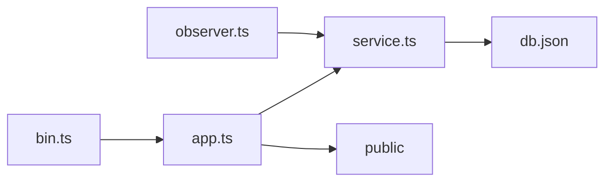

# typicode/json-server

> Fausse API REST complète à partir d'un fichier JSON, pour prototyper un frontend sans backend.

## Le problème
Développer ou tester un client tant que l'API réelle n'existe pas oblige à coder un serveur jetable.

## Ce que ça fait vraiment
On écrit un `db.json` ou `db.json5` ; `json-server` expose les routes CRUD par clé (tableaux et objets), avec filtres (`views:gt=100`), tri, pagination, `_embed`, `_where`, suppression en cascade et fichiers statiques depuis `./public`. Le code décrit un serveur Express, un service en mémoire et un observateur de fichier.

## Comment c'est branché


## Essayer
```bash
npm install json-server
npx json-server db.json
curl http://localhost:3000/posts/1
```

## Coût et pièges
Gratuit. La documentation affichée est la bêta v1 : ruptures possibles, notes de migration v0 vers v1 (id en chaîne, `_per_page`, `_embed`).

## Ce que ce n'est pas
Ce n'est pas une base de production : données en mémoire, sans authentification décrite. Anomalie : le rapport d'architecture cite une « Fair Source License », alors que le catalogue indique MIT ; le catalogue fait foi.

## Alternatives
Aucune alternative nommée dans le README.

## Pour toi
Adopter : pratique pour simuler une API de scoring ou de données pendant qu'un tableau de bord est développé.

