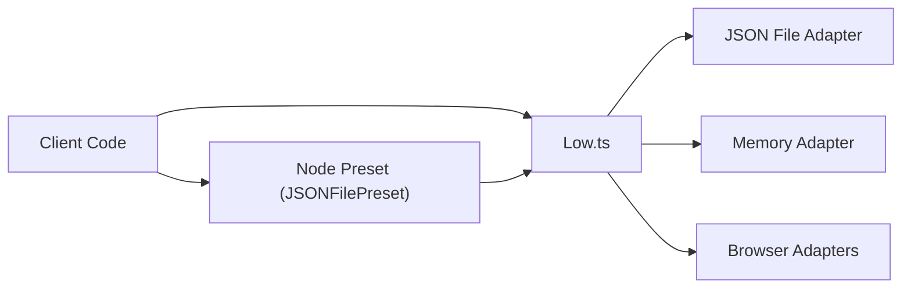

# typicode/lowdb

> Petite base de données JSON locale et typée pour scripts et applis JavaScript.

## Le problème
Pour un prototype ou un outil CLI, installer une vraie base est disproportionné ; écrire du JSON à la main expose aux écritures corrompues.

## Ce que ça fait vraiment
`db.data` est un objet JavaScript ordinaire qu'on modifie puis écrit avec `db.write()` ou `db.update()`.
Écritures atomiques ; requêtes via les méthodes natives des tableaux ou lodash.
Adaptateurs : fichier JSON, mémoire (pour les tests), localStorage/sessionStorage, texte, formats personnalisés (YAML, chiffrement).
Package ESM uniquement, typage TypeScript.

## Comment c'est branché


## Essayer
```bash
npm install lowdb
```

## Coût et pièges
Gratuit. Chaque `write` resérialise tout `db.data` : lent au-delà de 10–100 Mo. Incompatible avec le module cluster de Node.

## Ce que ce n'est pas
Pas une base de production : le README conseille PostgreSQL ou MongoDB pour monter en charge. Pas de concurrence entre processus.

## Alternatives
- PostgreSQL : recommandé par le README dès qu'il faut passer à l'échelle.
- MongoDB : même raison.

## Pour toi
À ignorer : outil JavaScript de prototypage ; en Python tu as déjà SQLite ou un simple fichier pour ces usages.
