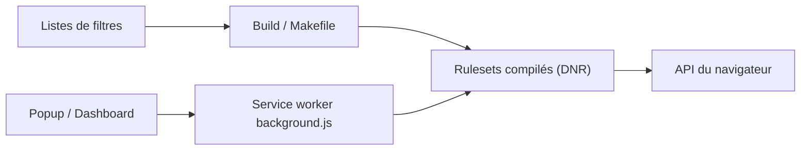

# uBlockOrigin/uBOL-home

> Bloqueur de contenu léger pour navigateurs, fondé sur l'API déclarative MV3.

## Le problème
Bloquer publicités et pisteurs sans processus permanent gourmand en CPU et mémoire.

## Ce que ça fait vraiment
Compile les listes de filtres (uBlock Origin, EasyList, EasyPrivacy, Peter Lowe) en jeux de règles statiques appliqués par le navigateur ; le service worker n'est actif que pour la fenêtre et les options. Arborescences distinctes pour Chromium, Firefox et Safari, paramètres administrables par stockage géré.

## Comment c'est branché


## Essayer
```bash
# Aucune commande : installation depuis Chrome Web Store, Firefox Add-ons,
# Edge Add-ons ou Safari App Store.
```

## Coût et pièges
Gratuit. Les problèmes de filtres se signalent via l'icône de chat dans l'extension, pas sur GitHub.

## Ce que ce n'est pas
Version allégée : moins complète que uBlock Origin classique, limitée par le modèle déclaratif. Ce dépôt sert de vitrine (« home »).

## Alternatives
- uBlock Origin : le bloqueur complet, mentionné par le nom de son jeu de filtres.

## Pour toi
À ignorer côté veille : extension grand public, sans lien avec les métiers data/IA/MLOps.

