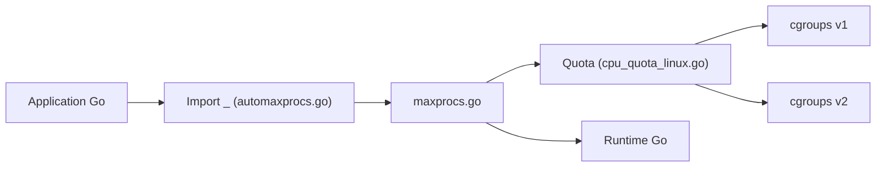

# uber-go/automaxprocs

> Bibliothèque Go qui ajuste GOMAXPROCS au quota CPU du conteneur Linux ; pour services Go sous Docker ou Kubernetes.

## Le problème
Dans un conteneur limité à 2 CPU, Go voit tous les cœurs de la machine : trop de threads, du throttling et une latence en queue qui s'envole.

## Ce que ça fait vraiment
Un import vide du paquet suffit : au démarrage, il lit le quota CPU cgroups (v1 ou v2) et règle `GOMAXPROCS` en conséquence. Une API configurable existe. Sur le répartiteur d'Uber avec 200 % de quota, aligner GOMAXPROCS sur le quota donne 44 715 req/s contre 22 191 avec la valeur par défaut (24), et supprime le throttling observé.

## Comment c'est branché


## Essayer
```bash
go get -u go.uber.org/automaxprocs
# puis dans le code : import _ "go.uber.org/automaxprocs"
```

## Coût et pièges
Gratuit, sans configuration. Les mesures du README viennent d'une charge interne d'Uber, non reproduites ici. Dernier push fin 2025 : stable, peu d'évolution.

## Ce que ce n'est pas
Ne concerne que Go et les quotas Linux ; sans effet hors conteneur limité. Ne règle pas la mémoire.

## Alternatives
Non documenté dans le README : aucune alternative nommée.

## Pour toi
Utile uniquement si tu opères des services Go (passerelles, sidecars) en conteneur ; sans Go dans ta pile data/IA, tu n'en as pas l'usage.

