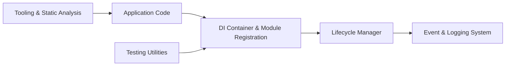

# uber-go/fx

> Système d'injection de dépendances pour applications Go, utilisé dans la plupart des services Go d'Uber.

## Le problème
Les applications Go finissent par reposer sur des variables globales et des `init()` qui rendent le code difficile à tester et à partager entre équipes.

## Ce que ça fait vraiment
Fx fournit un conteneur d'injection : on déclare des constructeurs (`provide`, `supply`), il résout les dépendances et pilote le cycle de vie (démarrage et arrêt ordonnés). Il émet des événements (`fxevent`, `fxlog`), fournit un paquet de test `fxtest` et un linter `fxlint`.

## Comment c'est branché


## Essayer
```bash
go get go.uber.org/fx@v1
```

## Coût et pièges
Gratuit. Version v1, SemVer strict : pas de changement cassant avant la v2.0.0. Chaque version majeure de Go est supportée jusqu'à deux versions plus récentes.

## Ce que ce n'est pas
Pas un framework web ni un outil data : c'est de la plomberie pour services Go. Le README ne compare pas Fx à d'autres injecteurs.

## Alternatives
Aucune alternative nommée dans le README.

## Pour toi
À ignorer : bibliothèque Go de structuration de services, sans usage direct en data, IA ou MLOps, sauf si tu écris toi-même des services Go.

