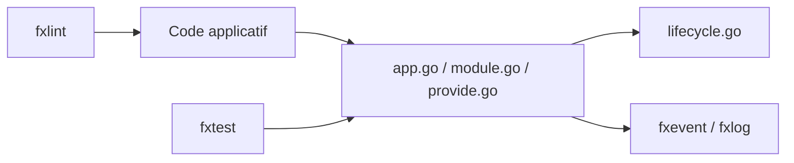

# uber-go/fx

> Système d'injection de dépendances pour Go, utilisé dans les services d'Uber.

## Le problème
Les variables globales et `init()` rendent les services Go difficiles à tester et à composer.

## Ce que ça fait vraiment
Enregistre des constructeurs, résout le graphe de dépendances, gère le cycle de vie (démarrage/arrêt) et journalise via `fxevent`/`fxlog`. Fournit `fxtest` et un linter (`tools/cmd/fxlint`). API v1 suivant SemVer.

## Comment c'est branché


## Essayer
```bash
go get go.uber.org/fx@v1
```

## Coût et pièges
Gratuit. Réservé à Go. Dernier push fin 2025 : encore récent.

## Ce que ce n'est pas
Pas un framework web ni un outil d'IA.

## Alternatives
Aucune alternative nommée dans le README.

## Pour toi
Ignorer : utile seulement pour des services Go, hors cœur data/IA.

