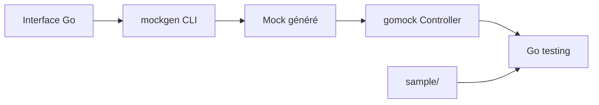

# uber-go/mock

> Framework de mocks pour Go, avec générateur `mockgen`, maintenu par Uber après abandon de golang/mock.

## Le problème
Tester du code Go qui dépend d'interfaces oblige à écrire des doublures à la main.

## Ce que ça fait vraiment
`mockgen` génère des mocks depuis un fichier source, une archive ou un package (modes source, archive, package). Dans les tests, un contrôleur gomock enregistre les attentes (`EXPECT().Bar(...).Return(...)`). Des formateurs personnalisent les messages d'échec, et l'option `-typed` produit des retours typés.

## Comment c'est branché


## Essayer
```bash
go install go.uber.org/mock/mockgen@latest
mockgen -version
mockgen -source=foo.go [other options]
mockgen database/sql/driver Conn,Driver
```

## Coût et pièges
Gratuit. Vérifier que `GOPATH/bin` est dans le `PATH`.

## Ce que ce n'est pas
Pas un outil de test d'intégration. Le projet d'origine, golang/mock, n'est plus maintenu par Google.

## Alternatives
- golang/mock : dépôt d'origine, plus maintenu par Google.

## Pour toi
À ignorer sauf si tu écris des services Go : utile pour un MLOps qui teste des opérateurs ou API en Go.

