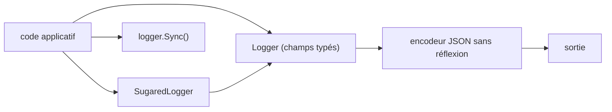

# uber-go/zap

> Journalisation structurée et à niveaux pour Go, pour du code qui logge dans le chemin chaud.

## Le problème
Sérialiser des `interface{}` avec `encoding/json` et `fmt.Fprintf` consomme du CPU et multiplie
les petites allocations : le logger devient le goulot du service.

## Ce que ça fait vraiment
Deux API. Le `SugaredLogger` accepte des paires clé-valeur faiblement typées et un style `printf`.
Le `Logger`, plus strict, n'accepte que des champs typés (`zap.String`, `zap.Int`, `zap.Duration`)
et alloue nettement moins. En dessous : un encodeur JSON sans réflexion ni allocation. Le README
publie ses propres mesures : 656 ns/op et 5 allocations pour un message à 10 champs, 67 ns/op et
0 allocation quand le contexte est déjà attaché au logger.

## Comment c'est branché


## Essayer
```bash
go get -u go.uber.org/zap
```
```go
logger, _ := zap.NewProduction()
defer logger.Sync()
logger.Info("failed to fetch URL",
  zap.String("url", url),
  zap.Int("attempt", 3),
  zap.Duration("backoff", time.Second),
)
```

## Coût et pièges
Gratuit, aucune dépendance de service. Seule contrainte annoncée : zap ne supporte que les deux
dernières versions mineures de Go. Oublier `defer logger.Sync()` laisse des lignes dans le tampon.

## Ce que ce n'est pas
Pas un collecteur ni un backend : zap écrit, il ne stocke ni n'indexe. Le `Logger` typé n'offre pas
de formatage `printf` — c'est le prix de l'absence d'allocation. Les chiffres du README sont ceux de
sa propre suite de bancs d'essai, et le README invite lui-même à les prendre avec précaution.

## Alternatives
- `zerolog` : plus rapide que zap sur les trois bancs publiés (380 ns/op, 1 allocation).
- `slog` (bibliothèque standard) : zéro dépendance, ~3× plus lent sur le banc à 10 champs.
- `logrus` : l'ancien standard, le plus lent des tableaux publiés.

## Pour toi
Le choix par défaut si tu écris du Go de service ; sinon `slog` suffit largement pour de l'outillage.
