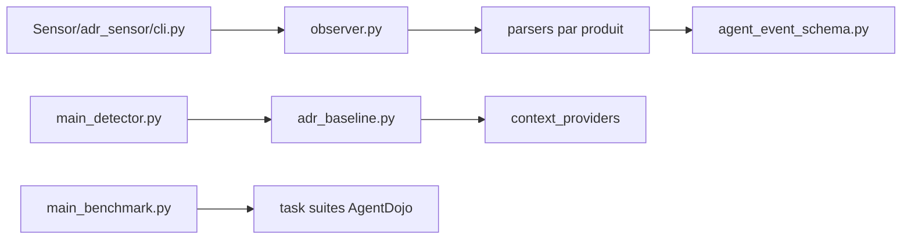

# uber/ADR

> Système de détection et réponse pour agents IA : capteur d'endpoints, benchmark d'attaques et détecteur.

## Le problème
Les agents de code (Claude Code, Cursor, Codex) exécutent des outils et des serveurs MCP sur les postes sans que la sécurité voie ce qu'ils font.

## Ce que ça fait vraiment
Le dépôt publie quatre briques : Discovery (inventaire d'applis IA et de serveurs MCP), Sensor (télémétrie normalisée depuis Claude Code, Cursor, Codex, Gemini CLI, etc.), ADR-Bench (300+ tâches, 134 serveurs MCP simulés, basé sur AgentDojo) et le détecteur double agent, avec LlamaFirewall comme alternative sans clé. La prévention et l'Explorer hors ligne ne sont pas publiés.

## Comment c'est branché


## Essayer
```bash
git clone https://github.com/uber/ADR
cd ADR/Detection
uv sync
export ANTHROPIC_API_KEY="..." OPENAI_API_KEY="..."
```

## Coût et pièges
Le détecteur par défaut appelle les API Anthropic et OpenAI : coût à ta charge. Pour un essai sans clé, `--detector llamafirewall`. Les données du benchmark sont synthétiques (faux identifiants, injections de prompt) : usage défensif seulement.

## Ce que ce n'est pas
Pas un produit complet : la prévention est absente. Le README annonce 300+ tâches puis 304 dans le tableau ; le déploiement chez Uber n'est pas reproductible avec ce dépôt seul.

## Alternatives
LlamaFirewall (baseline fournie), AgentDojo (embarqué pour le benchmark).

## Pour toi
À surveiller : référence utile pour évaluer la sécurité d'agents IA (benchmark reproductible), à tester avant tout déploiement sur des postes.
