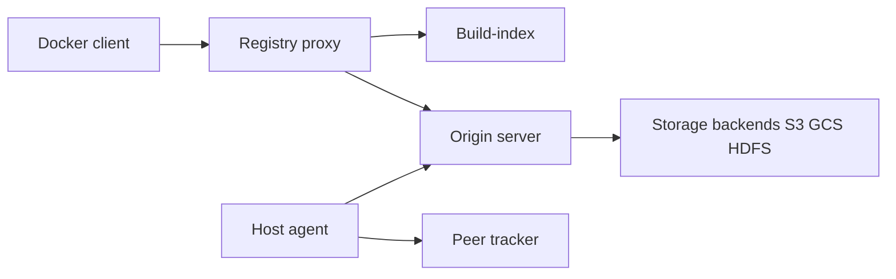

# uber/kraken

> Registre Docker P2P d'Uber pour distribuer très vite de grosses images à des milliers d'hôtes.

## Le problème
Quand des milliers de nœuds tirent la même image, le registre central devient le goulot d'étranglement.

## Ce que ça fait vraiment
Des agents sur chaque hôte échangent les blobs entre pairs, orchestrés par un tracker. Des origins seeders stockent les blobs sur S3, GCS, ECR ou HDFS, un proxy reçoit les pushes et un build-index associe tags et digests, avec réplication inter-clusters. En production chez Uber depuis 2018.

## Comment c'est branché


## Essayer
```bash
make images
make devcluster
helm install --name=kraken-demo ./helm
```

## Coût et pièges
Plusieurs composants à déployer et un backend de stockage à fournir. Muter un tag (`latest`) pose problème de cache et de réplication. Limite conseillée de 20 Go par blob.

## Ce que ce n'est pas
Ne rend pas `docker pull` magiquement plus rapide si le registre n'est pas le goulot (la décompression domine souvent).

## Alternatives
Dragonfly (Alibaba, superviseur central, scalabilité moindre selon le README) ; BitTorrent (conçu pour des environnements non fiables).

## Pour toi
À surveiller : pertinent si tu distribues de lourdes images de modèles à de nombreux nœuds GPU ; trop lourd pour un petit cluster.

