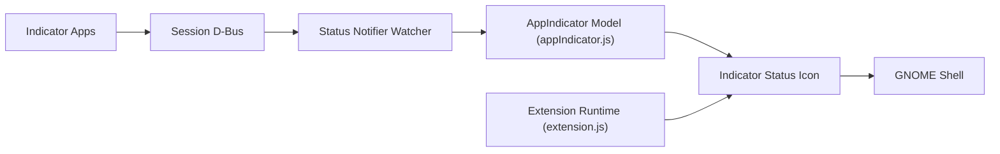

# ubuntu/gnome-shell-extension-appindicator

> Extension GNOME Shell affichant les icônes de zone de notification (AppIndicator) dans le panneau.

## Le problème
GNOME a retiré la zone de notification ; beaucoup d'applications (Electron notamment) y dépendent pour leur menu.

## Ce que ça fait vraiment
Découvre les AppIndicators et KStatusNotifierItems sur le bus D-Bus de session, modélise leurs propriétés et menus, et les place dans le panneau. Clic pour le menu, double clic pour activer la fenêtre, clic molette pour l'activation secondaire. Gère aussi les icônes de barre d'état historiques (X11). Les infobulles ne sont volontairement pas implémentées.

## Comment c'est branché


## Essayer
```bash
git clone https://github.com/ubuntu/gnome-shell-extension-appindicator.git
meson gnome-shell-extension-appindicator /tmp/g-s-appindicators-build
ninja -C /tmp/g-s-appindicators-build install
gnome-extensions enable appindicatorsupport@rgcjonas.gmail.com
```

## Coût et pièges
Gratuit ; recommandé via extensions.gnome.org. `libappindicator` doit être présent côté application. Sous Wayland, il faut se reconnecter après installation.

## Ce que ce n'est pas
Pas un gestionnaire de notifications. Les bugs sans étapes de reproduction sont fermés.

## Alternatives
Aucune alternative nommée dans le README.

## Pour toi
À ignorer : réglage de bureau Linux, sans lien avec la donnée ou l'IA, sauf besoin personnel de GNOME.

