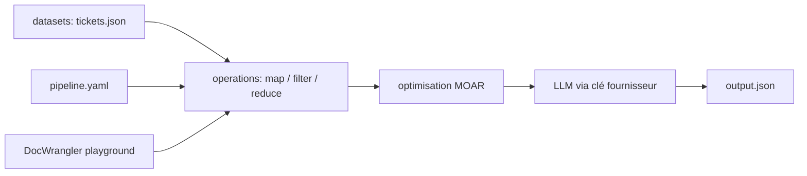

# ucbepic/docetl

> Pipelines map-reduce déclaratifs sur des documents, chaque opération écrite en langage naturel.

## Le problème
Traiter un gros corpus avec un LLM oblige à écrire chaque appel, à les câbler, puis à régler la précision à la main.
Le coût et la latence se découvrent après coup.

## Ce que ça fait vraiment
Des opérateurs prêts — map, filter, reduce, resolve, split, gather, extract — orchestrés et parallélisés.
Une optimisation automatique du pipeline : changement de modèle, réécriture de prompt, décomposition d'opération,
remplacement d'un sous-traitement par du code quand c'est possible. Le résultat sort en tables.
Deux surfaces : une API Python pour la production et un YAML déclaratif ; une UI DocWrangler pour itérer.

## Comment c'est branché


## Essayer
```bash
pip install docetl
export OPENAI_API_KEY=your_key   # or any LLM provider key
docetl run pipeline.yaml
```

## Coût et pièges
Chaque opération appelle un LLM : la facture est à ta charge et croît avec le volume de documents.
Des limites de débit se déclarent dans le code (`docetl.rate_limits`) ; les tests de base sont annoncés sous 0,01 $.

## Ce que ce n'est pas
Pas une base de données ni un moteur de requête : il produit des tables, il ne les stocke pas.
Pas déterministe — l'optimiseur peut changer de modèle et de prompt entre deux exécutions.
Pas gratuit en pratique, malgré l'installation en une ligne.

## Alternatives
Aucune alternative nommée dans le README.

## Pour toi
Le plus directement utile du lot pour un profil data : mesure sur cent documents avant d'en lancer cent mille.
