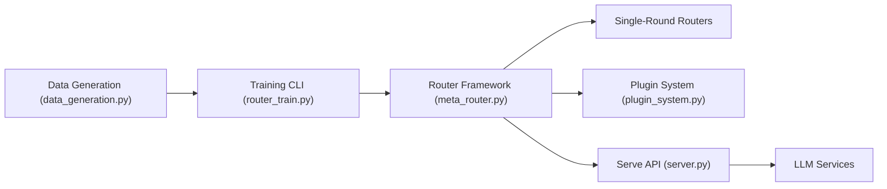

# ulab-uiuc/LLMRouter

> Bibliothèque de recherche pour entraîner et servir des routeurs qui choisissent le meilleur LLM par requête.

## Le problème
Envoyer chaque requête au plus gros modèle coûte cher ; au plus petit, la qualité baisse. Il faut décider modèle par modèle, requête par requête.

## Ce que ça fait vraiment
Plus de 16 routeurs (KNN, SVM, MLP, factorisation matricielle, Elo, graphes, personnalisés, agentiques) avec CLI `llmrouter` pour entraîner, inférer et chatter (Gradio). Un pipeline génère les données depuis 11 benchmarks, un système de plugins permet d'ajouter ses routeurs, et un serveur compatible OpenAI (OpenClaw Router) existe.

## Comment c'est branché


## Essayer
```bash
pip install llmrouter-lib
llmrouter train --router knnrouter --config configs/model_config_train/knnrouter.yaml
llmrouter infer --router knnrouter --config config.yaml --query "What is machine learning?" --route-only
```

## Coût et pièges
Les clés d'API (variable `API_KEYS`) servent à l'inférence et à la génération de données ; NVIDIA en fournit gratuitement. Entraîner certains routeurs demande un GPU. `--route-only` évite tout appel payant.

## Ce que ce n'est pas
Ce n'est pas une passerelle prête pour la production : c'est un cadre de recherche. Le benchmark xRouteBench rejoue des exécutions pré-enregistrées, il ne mesure pas vos propres modèles.

## Alternatives
- RouteLLM : travail dont plusieurs routeurs s'inspirent.
- RouterDC, AutoMix, GraphRouter : méthodes reprises comme routeurs.

## Pour toi
À surveiller : pertinent si tu compares des stratégies de routage de modèles ; peu utile si tu veux juste une passerelle.
