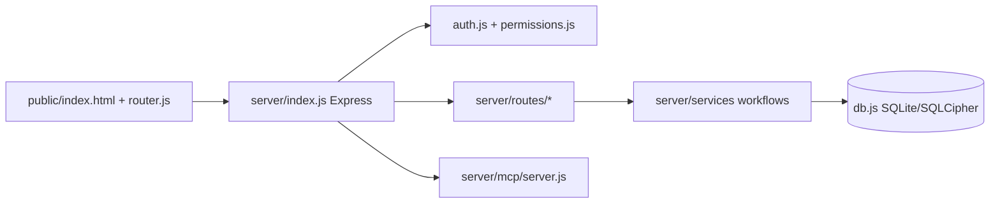

# ulsklyc/yuvomi

> Application auto-hébergée de gestion de foyer (tâches, budget, repas, santé), pour familles et couples.

## Le problème
Un foyer colle ensemble une dizaine d'applis payantes, chacune avec son compte, son abonnement et ses données chez un tiers.

## Ce que ça fait vraiment
Vingt modules activables séparément : tâches, calendrier, courses, repas, garde-manger, budget, documents, santé, rappels, sauvegardes. Les modules s'articulent : le plan de repas alimente la liste de courses, un reçu se rattache à la transaction. Serveur Node.js/Express, client PWA sans framework, une base SQLite avec chiffrement SQLCipher optionnel. Un point d'accès MCP et une spec OpenAPI existent pour les agents.

## Comment c'est branché


## Essayer
```bash
curl -O https://raw.githubusercontent.com/ulsklyc/yuvomi/main/docker-compose.yml
curl -O https://raw.githubusercontent.com/ulsklyc/yuvomi/main/.env.example
cp .env.example .env
openssl rand -hex 32   # SESSION_SECRET
openssl rand -hex 32   # DB_ENCRYPTION_KEY
docker compose up -d
```

## Coût et pièges
Gratuit, 256 Mo de RAM, port 3000. La clé de chiffrement est irrécupérable si perdue. Les binaires de documents (dossier, WebDAV, Drive) ne sont pas dans les sauvegardes de base. Données de santé : à chiffrer, et le RGPD relève de toi.

## Ce que ce n'est pas
Pas un dispositif médical. Pas un outil pour équipes : prévu pour deux à six personnes. Anciennement nommé Oikos (renommé pour un conflit de marque).

## Alternatives
Mealie ou Tandoor pour les seules recettes (le README sait les refléter en lecture seule).

## Pour toi
À ignorer : outil domestique hors périmètre data/IA/MLOps ; seul le point d'accès MCP a un intérêt de curiosité.
