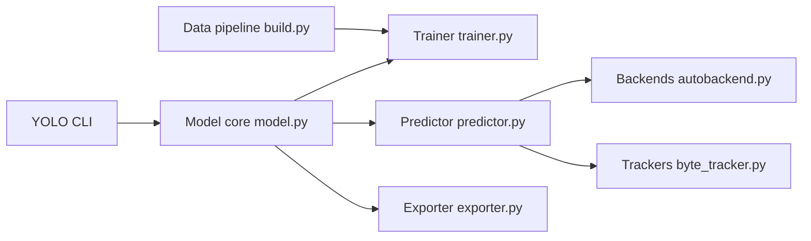

# ultralytics/ultralytics

> Bibliothèque et CLI YOLO pour entraîner, évaluer, prédire et exporter des modèles de vision.

## Le problème
Enchaîner détection, segmentation, pose, suivi et export vers ONNX/TensorRT exige sinon plusieurs dépôts et beaucoup de colle.

## Ce que ça fait vraiment
Une interface unique `YOLO(...)` / `yolo` pour train, val, predict, track, export, benchmark.
Tâches : détection, segmentation d'instance et sémantique, profondeur, classification, pose, OBB ; tracking ByteTrack/BoT-SORT.
Export vers ONNX, TensorRT, OpenVINO, CoreML, TFLite, NCNN… via `exporter.py` et `autobackend.py`.
Couche « solutions » : comptage, heatmaps, estimation de vitesse ; callbacks W&B, MLflow, Comet, ClearML.

## Comment c'est branché


## Essayer
```bash
pip install ultralytics
yolo predict model=yolo26n.pt source='https://ultralytics.com/images/bus.jpg'
yolo val detect data=coco.yaml device=0
```

## Coût et pièges
Gratuit sous AGPL-3.0 ; tout usage commercial fermé demande une licence Enterprise payante. GPU utile pour l'entraînement ; poids téléchargés au premier usage.

## Ce que ce n'est pas
Pas libre d'intégration dans un produit propriétaire sans licence. YOLO27 annoncé mais non disponible. Le Hub Ultralytics est un service distant optionnel.

## Alternatives
Non documenté : aucun dépôt alternatif nommé dans le README.

## Pour toi
Référence pour la vision ; adopter en interne, trancher la question AGPL avant tout livrable client.
