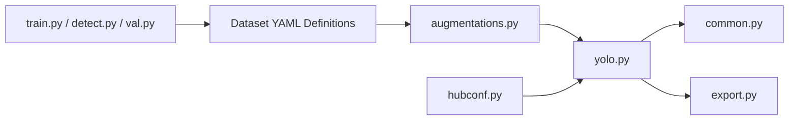

# ultralytics/yolov5

> Modèle PyTorch de détection, segmentation et classification d'images, pour qui déploie de la vision.

## Le problème
Entraîner et déployer un détecteur d'objets demande de recoller données, modèle, métriques et export vers ONNX/TensorRT à la main.

## Ce que ça fait vraiment
Scripts `train.py`, `detect.py`, `val.py`, `export.py`, plus variantes `segment/` et `classify/`.
Modèles décrits en YAML (`models/`), jeux de données et hyperparamètres en YAML (`data/`).
Chargement via PyTorch Hub (`hubconf.py`), export ONNX/CoreML/TensorRT, loggers W&B, Comet, ClearML.
Le README oriente lui-même vers le paquet `ultralytics` pour les architectures récentes.

## Comment c'est branché


## Essayer
```bash
git clone https://github.com/ultralytics/yolov5
cd yolov5
pip install -r requirements.txt
python detect.py --weights yolov5s.pt --source img.jpg
```

## Coût et pièges
Python ≥ 3.8, PyTorch ≥ 1.8. Entraînement COCO : 1 à 8 jours sur une V100 selon la taille. AGPL-3.0 : licence Enterprise payante pour un usage fermé.

## Ce que ce n'est pas
Pas la génération actuelle d'Ultralytics : pose, OBB et CLI unifiée sont dans `ultralytics`. L'AGPL contamine un produit distribué.

## Alternatives
- ultralytics (paquet `ultralytics`) : modèles YOLO récents, interface Python et CLI unifiée.

## Pour toi
Référence stable pour la détection, mais pars sur `ultralytics` pour un nouveau projet et vérifie l'AGPL.
