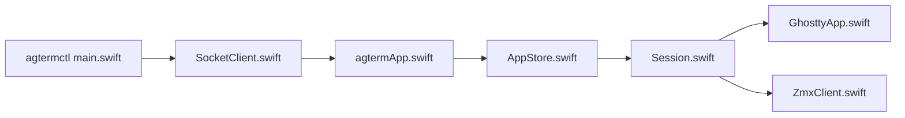

# umputun/agterm

> Terminal macOS minimaliste avec API de contrôle, pensé pour piloter plusieurs agents de code en parallèle.

## Le problème
Avec plusieurs agents de code concurrents, un terminal à onglets perd vite la trace de celui qui est actif, bloqué ou terminé.

## Ce que ça fait vraiment
Fenêtres, workspaces nommés et sessions ; splits, scratch, overlays. `agtermctl` pilote tout via un socket local : créer des sessions, taper dedans, lire le texte, définir un statut. Trois modes de restauration (dont processus vivants via zmx). Hooks de statut pour Claude Code, Codex, etc. Moteur terminal : libghostty.

## Comment c'est branché


## Essayer
```bash
brew install --cask umputun/apps/agterm
agtermctl session new --workspace "$ws" --cwd "$PWD" --no-select
agtermctl session status blocked --target "$sid"
agtermctl tree --json
```

## Coût et pièges
Gratuit. Apple Silicon, macOS 14+. Le mode « live sessions » exige zsh comme shell de connexion.

## Ce que ce n'est pas
Pas de véritable intégration agent profonde, volontairement. Pas multiplateforme (ports Linux/Windows indépendants).

## Alternatives
- agterm-linux et agwinterm : ports tiers pour Linux et Windows.
- Rook : fork orienté fonctions hors périmètre.

## Pour toi
À surveiller : utile si tu orchestres plusieurs agents sur Mac ; sinon un terminal classique suffit.

