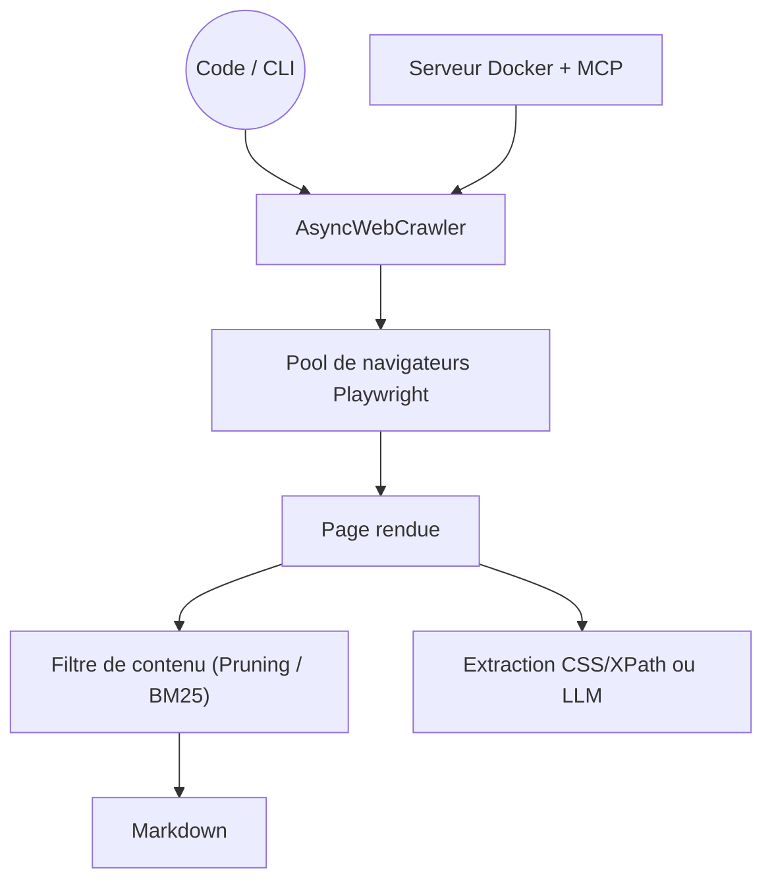

# unclecode/crawl4ai

> Crawler et scraper open source qui transforme le web en Markdown propre pour RAG et agents.

## Le problème
Le HTML récupéré brut est inexploitable : menus, bannières, scripts noient le contenu utile.
Les services qui font ce nettoyage demandent un compte, un jeton et une facture.

## Ce que ça fait vraiment
Génère un Markdown structuré, avec un mode « fit » qui filtre le bruit par heuristique ou BM25.
Extraction structurée sans LLM par schéma CSS/XPath, ou avec LLM via une stratégie dédiée et un schéma Pydantic.
Contrôle complet du navigateur : sessions, profils persistants, proxies, cookies, hooks, exécution de JS, CDP distant.
Déploiement Docker avec tableau de bord temps réel, terrain de jeu interactif et intégration MCP.

## Comment c'est branché


## Essayer
```bash
pip install -U crawl4ai
crawl4ai-setup
crawl4ai-doctor
crwl https://docs.crawl4ai.com --deep-crawl bfs --max-pages 10
```

## Coût et pièges
Gratuit ; seule l'extraction par LLM consomme une clé d'API. Playwright télécharge un Chromium complet.
L'usage impose une attribution visible (badge ou ligne de texte) dans ta documentation.

## Ce que ce n'est pas
Pas exempt de surface d'attaque : la v0.9.3 corrige cinq avis de sécurité (écriture de fichier, SSRF, DoS, XSS).
Pas un service géré — la v0.9.0 verrouille le serveur Docker par défaut, à toi de l'exposer correctement.
La version synchrone (Selenium) est dépréciée et sera retirée.

## Alternatives
- `D4Vinci/Scrapling` : parser adaptatif et framework de spiders, plus proche de Scrapy.
- `browser-use/browser-use` : quand il faut un agent qui décide, pas un crawler qui exécute.

## Pour toi
La brique la plus directe pour alimenter un RAG depuis le web. À adopter, en suivant les correctifs de sécurité.
