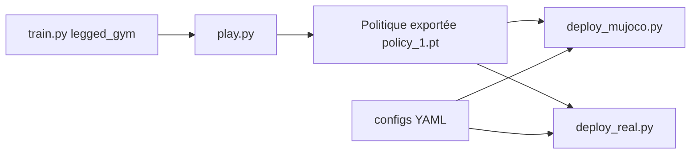

# unitreerobotics/unitree_rl_gym

> Code d'apprentissage par renforcement pour faire marcher les robots Unitree (Go2, H1, H1_2, G1), de la simulation au réel.

## Le problème
Apprendre une politique de locomotion en simulation puis la faire tourner sur un robot physique demande un enchaînement de scripts cohérent.

## Ce que ça fait vraiment
Le flux est Entraîner, Rejouer, Sim2Sim, Sim2Real. `train.py` et `play.py` (base legged_gym, Isaac Gym, rsl_rl) entraînent et exportent le réseau acteur ; `deploy_mujoco.py` teste la politique dans MuJoCo avec un YAML par robot ; `deploy_real.py` la déploie via `unitree_sdk2_python`. Un exemple C++ pour le G1 s'appuie sur LibTorch.

## Comment c'est branché


## Essayer
```bash
python legged_gym/scripts/train.py --task=xxx
python legged_gym/scripts/play.py --task=xxx
python deploy/deploy_mujoco/deploy_mujoco.py g1.yaml
python deploy/deploy_real/deploy_real.py {net_interface} {config_name}
```

## Coût et pièges
L'installation est décrite dans un `setup.md` externe. Il faut un GPU pour Isaac Gym, et le robot en mode débogage pour le déploiement réel. Dernier push en juillet 2025.

## Ce que ce n'est pas
Pas un cadre générique de RL : il est taillé pour les robots Unitree. La politique préentraînée fournie sert de démonstration, pas de garantie sur ton matériel.

## Alternatives
Le README cite ses fondations : legged_gym, rsl_rl et mujoco.

## Pour toi
À ignorer sauf si tu as un robot Unitree : matériel spécifique, simulateur hors pile MLOps habituelle, projet peu actif.
