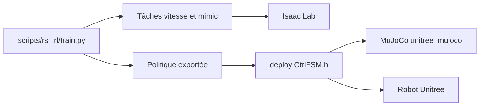

# unitreerobotics/unitree_rl_lab

> Environnements d'apprentissage par renforcement sous Isaac Lab pour robots Unitree Go2, H1 et G1, jusqu'au déploiement.

## Le problème
Entraîner une politique de marche en simulation puis la faire tourner sur un vrai robot demande un chemin de bout en bout.

## Ce que ça fait vraiment
Tâches d'entraînement en vitesse et en imitation de mouvement (PPO via rsl_rl) pour Go2, H1 et G1-29dof sous Isaac Lab, puis contrôleurs C++ qui exécutent la politique exportée dans MuJoCo (sim2sim) ou sur le robot (sim2real) par une machine à états, avec ONNX Runtime.

## Comment c'est branché


## Essayer
```bash
./unitree_rl_lab.sh -i
./unitree_rl_lab.sh -l
./unitree_rl_lab.sh -t --task Unitree-G1-29dof-Velocity
./unitree_rl_lab.sh -p --task Unitree-G1-29dof-Velocity
```

## Coût et pièges
Gratuit, mais Isaac Lab (GPU NVIDIA) doit être installé d'abord, ainsi que les fichiers de description du robot (USD ou URDF) et `unitree_sdk2` pour le déploiement. La commande sim2real pilote un vrai robot : l'ancien programme embarqué doit être fermé.

## Ce que ce n'est pas
Pas un cadre RL générique : il est lié aux robots Unitree et à Isaac Lab. Le README ne documente pas la conception des récompenses.

## Alternatives
IsaacLab (dont il dépend), unitree_mujoco pour le sim2sim.

## Pour toi
À ignorer sauf si tu possèdes un robot Unitree : très lié à un matériel précis et à Isaac Lab.
