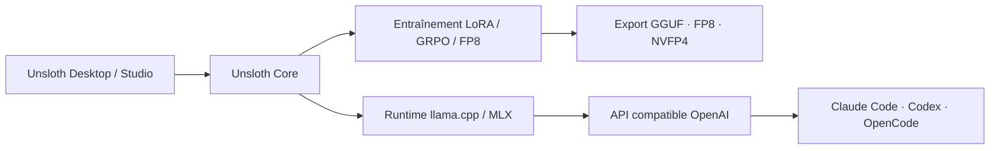

# unslothai/unsloth

> Application de bureau et bibliothèque pour exécuter et entraîner des LLM en local.

## Le problème
Fine-tuner un LLM demande une pile CUDA fragile, beaucoup de VRAM et du code d'entraînement à écrire. Faire tourner un modèle local pour un agent de code relève encore d'un montage manuel.

## Ce que ça fait vraiment
Trois formes : une app de bureau (Windows/macOS/Linux), une WebUI « Unsloth Studio », et « Unsloth Core », la bibliothèque Python. Entraînement LoRA, QLoRA, full fine-tuning, GRPO, DPO, FP8 ; export GGUF, NVFP4, FP8. Sert les modèles via une API compatible OpenAI. `unsloth start claude` branche Claude Code, Codex ou OpenCode sur un modèle local. Supporte NVIDIA, AMD (image ROCm séparée), Intel, CPU et Vulkan.

## Comment c'est branché


## Essayer
```bash
curl -fsSL https://unsloth.ai/install.sh | sh
unsloth studio
unsloth start claude --model unsloth/Qwen3.8-27B-GGUF:UD-Q4_K_XL
```

## Coût et pièges
GPU et VRAM à ta charge. Les outils serveur sont **actifs par défaut** : exposer Studio sans `--disable-tools` ni mot de passe fort est dangereux. Les ports Docker publient sur toutes les interfaces.

## Ce que ce n'est pas
Ce n'est pas un service hébergé : tout tourne chez toi, avec les coûts matériels correspondants. Ce n'est pas un remplaçant de vLLM en production multi-utilisateurs. La piste ROCm/WSL2 demande une build par architecture.

## Alternatives
- llama.cpp : le moteur d'exécution sous-jacent, si tu ne veux qu'inférer.
- transformers / TRL de Hugging Face : l'entraînement sans surcouche.

## Pour toi
À adopter si tu fine-tunes sur ta propre machine ; c'est la voie la plus courte entre un dataset et un GGUF servi.
