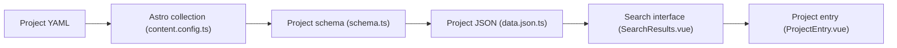

# up-for-grabs/up-for-grabs.net

> Source du site Up For Grabs, annuaire de projets open source avec tâches pour nouveaux contributeurs.

## Le problème
Les débutants ne savent pas où trouver des projets ouverts avec de petites tâches accessibles.

## Ce que ça fait vraiment
Contient les fichiers YAML décrivant les projets listés et le site qui les affiche. La version bêta (Astro + Vue) charge et valide les YAML, expose un JSON au build, puis le navigateur filtre par texte et activité récente ; un ancien listing JavaScript subsiste avec filtres par URL et pagination. Proposer un projet se fait par pull request.

## Comment c'est branché


## Essayer
```bash
npm install
npm run dev
npm run build
npm run preview
```

## Coût et pièges
Gratuit. La licence est « présente mais non identifiée » par GitHub : à vérifier avant de réutiliser le code.

## Ce que ce n'est pas
Pas un moteur de matching contributeur/projet : c'est un catalogue curé à la main, avec des projets pouvant être inactifs.

## Alternatives
Aucune alternative nommée dans le README.

## Pour toi
À ignorer : utile pour trouver un premier projet où contribuer, mais ce n'est pas un outil pour ton quotidien data/MLOps.

