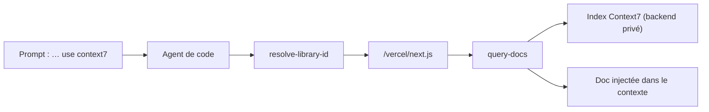

# upstash/context7

> Injecte dans le prompt la doc à jour et versionnée de la bibliothèque visée.

## Le problème
Un LLM répond sur la base de son entraînement : exemples périmés, API hallucinées, réponses pour une ancienne version du paquet.

## Ce que ça fait vraiment
Récupère la documentation et des exemples de code depuis la source et les place directement dans le contexte. Deux modes : CLI + Skills (l'agent appelle `ctx7`, sans MCP) ou serveur MCP (`https://mcp.context7.com/mcp`, clé en en-tête `Authorization: Bearer`). Deux outils MCP : `resolve-library-id` (nom → identifiant Context7) et `query-docs` (identifiant + question → doc pertinente). On peut court-circuiter la résolution en donnant l'identifiant (`/supabase/supabase`) ou préciser une version dans le prompt.

## Comment c'est branché


## Essayer
```bash
npx ctx7 setup
npx ctx7 remove
```

## Coût et pièges
Node 18+. Clé d'API gratuite recommandée sur context7.com/dashboard pour relever les limites de débit. Le backend API, le moteur de parsing et le crawler sont **privés** : ce dépôt ne contient que le serveur MCP.

## Ce que ce n'est pas
Ce n'est pas une garantie d'exactitude : le README indique que les projets indexés sont contribués par la communauté et que ni la justesse, ni la complétude, ni la sécurité de la doc ne sont garanties — un bouton « Report » existe pour le contenu suspect. Ce n'est pas un outil hors ligne.

## Alternatives
Aucune alternative nommée dans le README.

## Pour toi
À adopter : le rapport effort/bénéfice est excellent quand tu codes contre des bibliothèques qui bougent vite.
