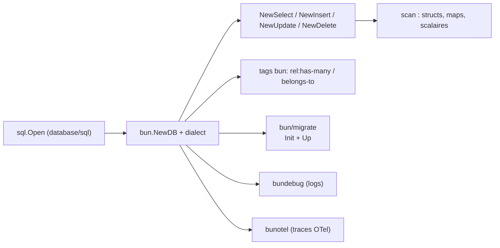

# uptrace/bun

> ORM Go orienté SQL pour PostgreSQL, MySQL, MSSQL, SQLite et Oracle.

## Le problème
Les ORM Go cachent le SQL et rendent les requêtes complexes illisibles ; écrire du `database/sql`
brut fait perdre le typage, le scan des résultats et la portabilité entre moteurs.

## Ce que ça fait vraiment
Construit les requêtes en Go avec une API qui suit la forme du SQL (`NewSelect`, `ColumnExpr`,
`TableExpr`, `With` pour les CTE), et scanne les résultats dans des structs, des maps, des scalaires
ou des variables individuelles. Les relations (`has-many`, `has-one`, `belongs-to`) se déclarent par
tags de struct et se chargent avec `Relation()`. Fournit insertions, mises à jour et suppressions en
masse, un système de migrations versionnées (`migrate.NewMigrations`, `migrator.Up`), les fixtures,
la suppression logique, un hook de log verbeux (`bundebug`) et un hook OpenTelemetry (`bunotel`).
Construit au-dessus de `database/sql`.

## Comment c'est branché


## Essayer
```bash
go get github.com/uptrace/bun
```

## Coût et pièges
Gratuit, aucune dépendance de service. Le pilote et le dialecte doivent correspondre au moteur
(`sqlitedialect` + `sqliteshim` pour SQLite, etc.). Le README pousse l'APM maison Uptrace :
l'intégration OTel est réelle, le produit derrière est commercial.

## Ce que ce n'est pas
Pas un générateur de schéma depuis la base : les modèles sont écrits à la main en Go. Pas un ORM qui
dispense de connaître SQL — c'est même l'inverse assumé. Les exemples du README ignorent les erreurs
retournées (`db.NewInsert().Model(user).Exec(ctx)` sans vérification), ce n'est pas du code à copier.

## Alternatives
Aucun ORM concurrent nommé : le README ne cite que les projets frères de l'auteur (routeur HTTP,
msgpack) et Uptrace.

## Pour toi
Hors périmètre : rien pour un profil data / IA / MLOps, sauf si tu maintiens un service Go.
