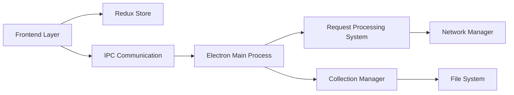

# usebruno/bruno

> Client d'API open source hors ligne, à collections en fichiers texte versionnables avec Git.

## Le problème
Les clients d'API classiques stockent les collections dans le cloud, ce qui complique le partage, le contrôle de version et la confidentialité.

## Ce que ça fait vraiment
Application de bureau qui enregistre chaque requête dans un fichier texte au format Bru, dans un dossier de ton disque. Tu collabores avec Git. Une CLI (`bru`) lance les collections en CI, avec des images Docker officielles. Pas de synchronisation cloud, « ni maintenant ni jamais » selon le README.

## Comment c'est branché

Le texte d'architecture est un guide de dessin partiellement supposé.

## Essayer
```bash
brew install bruno
npm install -g @usebruno/cli
bru run
bru run folder --env Local
docker pull usebruno/cli:latest
docker run -v $(pwd):/bruno usebruno/cli run
```

## Coût et pièges
L'essentiel est gratuit ; des versions commerciales ajoutent des fonctions. La marque « Bruno » appartient à Anoop M D. Beaucoup d'issues ouvertes (1 851).

## Ce que ce n'est pas
Ce n'est pas un outil de collaboration cloud : le partage passe par Git. Ce n'est pas non plus un outil de charge ou de surveillance.

## Alternatives
- Postman (cité comme référence à remplacer) : à préférer si tu as besoin de synchronisation cloud.

## Pour toi
À adopter : tester des endpoints de modèles ou d'API MLOps avec des collections versionnées et un lancement en CI via la CLI ou Docker.

