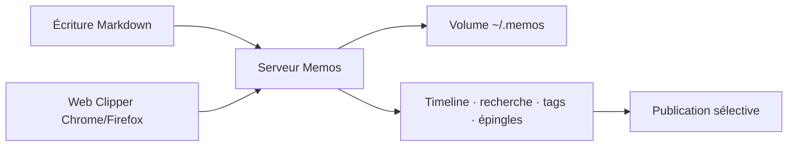

# usememos/memos

> Carnet de notes courtes auto-hébergé, en Markdown chronologique.

## Le problème
Les notes rapides finissent éparpillées entre messageries et fichiers, ou enfermées dans un espace de travail tout-en-un qu'il faut structurer avant d'écrire.

## Ce que ça fait vraiment
Un fil chronologique de mémos Markdown : notes du jour, liens, journaux de travail, extraits. On écrit et on enregistre sans choisir de titre, de dossier ni de gabarit. Relecture par le fil, la recherche, les tags et les épingles. Chaque mémo reste privé ou est publié à la demande. Une extension navigateur (Chrome, Firefox) capture pages, sélections et images en Markdown avec le lien source.

## Comment c'est branché


## Essayer
```bash
docker run -d \
  --name memos \
  -p 5230:5230 \
  -v ~/.memos:/var/opt/memos \
  neosmemo/memos:stable
```

## Coût et pièges
Gratuit, licence MIT, aucune télémétrie annoncée. Le stockage tient dans le volume monté : la sauvegarde est à ta charge.

## Ce que ce n'est pas
Ce n'est pas un espace de travail tout-en-un : pas de base de données ni de gestion de projet. L'organisation est volontairement légère — pas d'arborescence de dossiers. Les options d'installation autres que Docker sont renvoyées au guide de déploiement.

## Alternatives
Aucune alternative nommée dans le README.

## Pour toi
À adopter si tu veux un journal de travail auto-hébergé en une commande, indexable et sans dépendance cloud.
