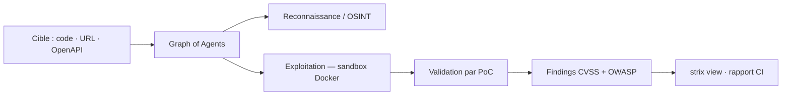

# usestrix/strix

> Agents IA autonomes de test d'intrusion applicatif, en local via Docker.

## Le problème
Un pentest manuel prend des semaines ; l'analyse statique noie l'équipe sous les faux positifs sans preuve d'exploitabilité.

## Ce que ça fait vraiment
Des agents exécutent le code dynamiquement, cherchent des vulnérabilités et les valident par des preuves de concept réelles. Outillage embarqué : proxy d'interception HTTP (Caido), navigateur automatisé, shell, runtime d'exploit Python en bac à sable, reconnaissance/OSINT, SAST + DAST, base de connaissances avec score CVSS et classification OWASP. Orchestration multi-agents pour la reconnaissance, l'exploitation et la post-exploitation. Cibles : dossier local, dépôt GitHub, URL, ou contrat OpenAPI/Postman. Mode headless pour CI, avec code de sortie non nul en cas de vulnérabilité.

## Comment c'est branché


## Essayer
```bash
curl -sSL https://strix.ai/install | bash
export STRIX_LLM="openrouter/z-ai/glm-5.3"
export LLM_API_KEY="your-api-key"
strix --target ./app-directory
strix view
```

## Coût et pièges
Docker doit tourner ; le premier run tire l'image de bac à sable. La consommation LLM est à ta charge, sauf à passer par l'abonnement ChatGPT (`strix auth login chatgpt`) ou le cloud géré. `strix view` écoute sur `127.0.0.1` et imprime un lien porteur d'un jeton d'accès au run : à ne pas partager à la légère.

## Ce que ce n'est pas
Ce n'est pas un scanner statique, et ce n'est pas utilisable sans autorisation sur une cible qui ne t'appartient pas. Le SSO, les rapports de conformité (SOC 2, ISO 27001, PCI DSS) et le déploiement VPC sont réservés à l'offre entreprise.

## Alternatives
Aucune alternative nommée dans le README.

## Pour toi
À surveiller : utile pour passer tes propres apps au crible en CI, sous réserve d'un cadre d'autorisation écrit.
