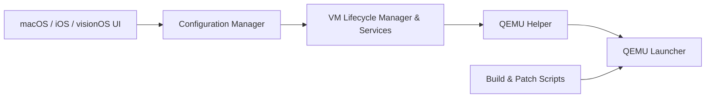

# utmapp/UTM

> Application d'émulation et de machines virtuelles pour macOS et iOS, fondée sur QEMU.

## Le problème
Faire tourner Windows ou Linux sur un Mac, un iPhone ou un iPad, y compris avec des processeurs d'architecture différente.

## Ce que ça fait vraiment
- Émulation système complète via QEMU, plus de 30 processeurs (x86_64, ARM64, RISC-V).
- Sur macOS : virtualisation accélérée (Hypervisor.framework) et invités macOS via Virtualization.framework (macOS 12+).
- Sur iOS : la JIT exige un appareil jailbreaké ou un contournement ; la variante UTM SE utilise un interpréteur à threads, plus lent, installable sans JIT.
- Une interface écrite pour les plateformes Apple, un contrôle par `utmctl` et de la gestion à distance d'après l'architecture.

## Comment c'est branché

## Essayer
Le README ne donne pas de commande : installation via https://getutm.app/install/ (iOS) et https://mac.getutm.app/ (macOS).

## Coût et pièges
Gratuit selon le README. Émulation sans JIT nettement plus lente. Sur iOS, l'installation demande un chargement latéral. 1 124 issues ouvertes au catalogue.

## Ce que ce n'est pas
Ce n'est pas un hyperviseur pour Linux ou Windows, ni un outil de sécurité en soi. Le dépôt classé à double usage n'est ici qu'un émulateur généraliste.

## Alternatives
- iSH : terminal Linux en mode utilisateur sur iOS.
- a-shell : commandes Unix natives sur iOS.

## Pour toi
À ignorer sauf si tu travailles sur Mac : utile pour tester un Linux ou une autre architecture en local, mais rien de spécifique data / IA / MLOps, et sans GPU pour l'entraînement.

