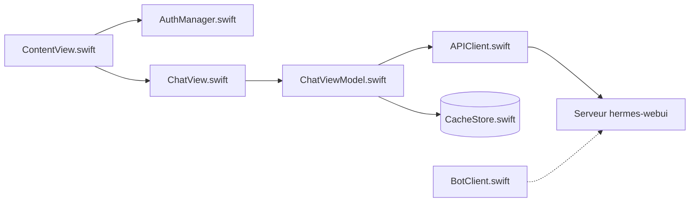

# uzairansaruzi/hermex

> Application iPhone native pour piloter depuis son téléphone un agent Hermes auto-hébergé.

## Le problème
Un agent qui tourne sur ta machine ne s'utilise que depuis un navigateur ou un terminal ; le suivre ou le relancer depuis un mobile est pénible.

## Ce que ça fait vraiment
Client SwiftUI (iOS 18+) pour un serveur hermes-webui : chat avec choix du modèle, de l'effort de raisonnement, du workspace et du profil ; pièces jointes ; streaming avec réflexion et appels d'outils.
Arrêter ou réorienter une exécution en cours ; sessions lisibles hors ligne via un cache local.
Tâches cron, skills, explorateur de fichiers et vue Git du serveur, mémoire et statistiques en lecture seule.
Mode Bot : connexion directe à hermes-agent. Push optionnel via un relais open source auto-hébergeable.

## Comment c'est branché


## Essayer
```bash
xcodebuild -project HermesMobile.xcodeproj -scheme HermesMobile -destination 'platform=iOS Simulator,name=iPhone 17' build
xcodebuild test -project HermesMobile.xcodeproj -scheme HermesMobile -destination 'platform=iOS Simulator,name=iPhone 17'
xcrun simctl list devices available
tailscale serve --bg 8787
```

## Coût et pièges
Gratuit, sans achat intégré. Il faut ton propre serveur hermes-webui (Python 3.11+) exposé en HTTPS (Cloudflare Tunnel, reverse proxy ou Tailscale Serve) ; le sécuriser et le maintenir est à ta charge. Compilation : Xcode 26.

## Ce que ce n'est pas
Pas un agent : aucun backend fourni, le téléphone ne fait que piloter.
Pas garanti compatible : l'API amont n'est pas stable, l'appli est testée contre un commit précis (`UPSTREAM_TESTED_SHA`).
iPhone uniquement.

## Alternatives
Aucune alternative nommée dans le README.

## Pour toi
À ignorer, sauf si tu fais déjà tourner Hermes chez toi.
