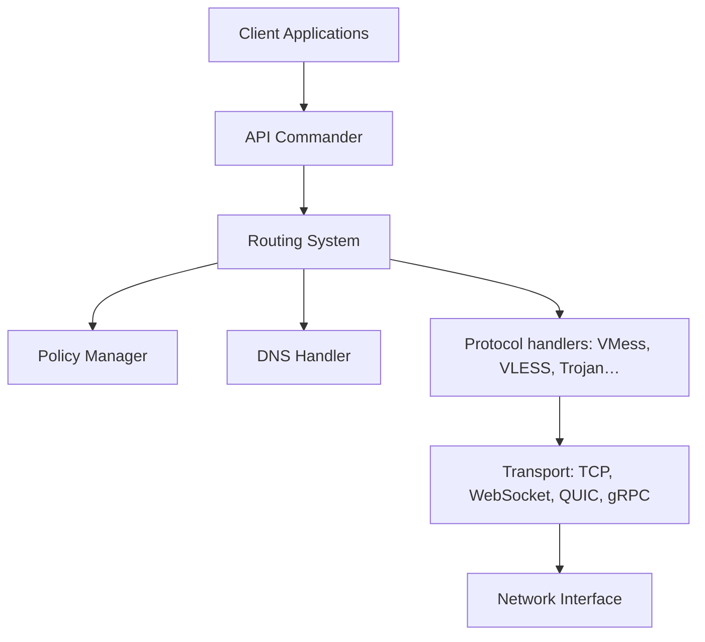

# v2fly/v2ray-core

> Plateforme de proxy réseau modulaire (Project V), pour qui veut construire des chemins réseau configurables.

## Le problème
Le README fourni ne le dit pas : il ne contient que des liens et des crédits. D'après l'architecture, il s'agit de disposer d'un proxy où protocoles, transports et règles d'acheminement se combinent à volonté.

## Ce que ça fait vraiment
Fiche minimale : README de moins de 800 caractères. D'après l'architecture décrite d'après le code, le cœur est découpé en couches : transport, proxy (VMess, VLESS, Shadowsocks, Trojan, SOCKS, HTTP, Dokodemo-door), app (DNS, routage, politiques, statistiques) et services communs. Il y a aussi du multiplexage, un observatoire de qualité de connexion, une gestion d'abonnements et des API de pilotage (commander). Le reste (installation, configuration) n'est pas documenté ici.

## Comment c'est branché


## Essayer
```bash
# Aucune commande documentée dans le README fourni.
```

## Coût et pièges
Logiciel libre (MIT), gratuit. Le README ne décrit aucun prérequis ni procédure d'installation : il faut se reporter à la documentation externe citée en lien.

## Ce que ce n'est pas
Ce n'est pas un produit clé en main : c'est un moteur de proxy, sans interface fournie d'après le README. Un outil de ce type relève, selon les pays, de règles légales locales sur l'usage des proxys et du chiffrement ; l'utilisateur en est responsable.

## Alternatives
Aucune alternative nommée dans le README.

## Pour toi
À surveiller plutôt qu'adopter : le dépôt est actif et très suivi, mais la matière fournie est insuffisante pour juger de son intérêt dans un travail data / IA / MLOps, où il ne sert qu'en infrastructure réseau.

