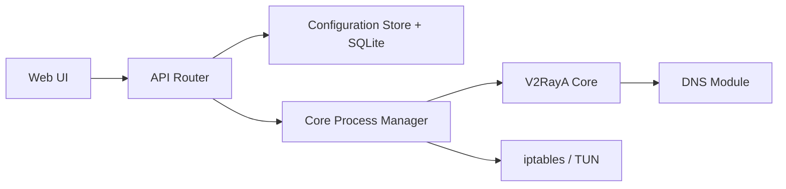

# v2rayA/v2rayA

> Client web pour un cœur Xray, avec proxy transparent sous Linux, Windows et macOS.

## Le problème
Configurer un cœur de proxy (abonnements, règles de routage, proxy transparent) en ligne de commande est fastidieux.

## Ce que ça fait vraiment
Un service avec interface web : importe abonnements et liens de partage (VMess, VLESS, Shadowsocks, Trojan, Hysteria2, TUIC, WireGuard, SOCKS5, HTTP), regroupe des nœuds et choisit le plus rapide, applique des règles RoutingA. Proxy transparent par `redirect`, `tproxy` ou `tun`. Base SQLite et traitement DNS dédié.

## Comment c'est branché


## Essayer
```bash
sudo apt install v2raya
sudo systemctl enable --now v2raya
docker run -d --restart=always --privileged --network=host --name v2raya ghcr.io/v2raya/v2raya
```

## Coût et pièges
Écoute sur `0.0.0.0:2017` ; le premier compte créé devient administrateur, sans connexion préalable : limiter l'accès avant l'enregistrement. Droits root pour le proxy transparent, conteneur privilégié. Requêtes réseau vers GitHub, une NTP chinoise (`ntp.aliyun.com`) et des sources de règles. Licence AGPL-3.0.

## Ce que ce n'est pas
Ce n'est pas un service de proxy fourni : il faut des nœuds de ton côté. ShadowsocksR n'est pas supporté.

## Alternatives
Aucune alternative nommée dans le README (le dépôt de paquets Dae Universe est une source d'installation).

## Pour toi
À ignorer : outil réseau sans rapport avec la data, l'IA ou le MLOps, avec une surface d'administration à sécuriser.

