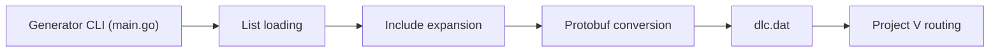

# v2ray/domain-list-community

> Listes de domaines par catégorie compilées en `dlc.dat` pour les règles de routage de Project V.

## Le problème
Écrire à la main des règles de routage par domaine (publicités, services, régions) dans V2Ray est long et incohérent.

## Ce que ça fait vraiment
Chaque fichier du dossier `data` est une liste (domain, keyword, regex, full, include, attributs `@`). Le générateur Go charge les listes, développe les `include:`, convertit en enregistrements GeoSite (protobuf) et écrit `dlc.dat`, utilisé dans la configuration par `geosite:nom`. Ce dépôt ne sert plus qu'à publier `dlc.dat` ; issues et PR sont traitées dans v2fly/domain-list-community.

## Comment c'est branché


## Essayer
```bash
go get -u -v --insecure github.com/v2ray/domain-list-community
$(go env GOPATH)/bin/domain-list-community
$(go env GOPATH)/bin/domain-list-community --datapath=/path/to/your/custom/data/directory
```

## Coût et pièges
Gratuit. Le dépôt est déplacé : utiliser v2fly pour contribuer. L'option `--insecure` du `go get` du README est à éviter.

## Ce que ce n'est pas
Pas un outil de blocage ni de contournement en soi : le README dit ne rien recommander sur les domaines à bloquer ou proxifier.

## Alternatives
- v2fly/domain-list-community (cité) : le dépôt qui reçoit désormais les contributions.

## Pour toi
À ignorer : utile uniquement si tu administres un routage V2Ray.

