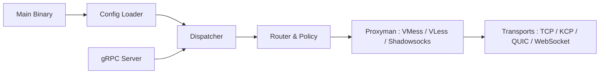

# v2ray/v2ray-core

> Ancien dépôt d'un moteur proxy réseau en Go, désormais déplacé vers v2fly/v2ray-core.

## Le problème
Construire ses propres chemins réseau chiffrés, avec routage et choix de protocole de transport, sans passer par une solution unique.

## Ce que ça fait vraiment
Le README, très court, dit seulement que Project V est un ensemble d'outils réseau qui sécurisent les connexions. D'après l'architecture du code : un moteur modulaire en Go avec répartiteur, routage et politiques, résolveur DNS, statistiques, journalisation, des modules de protocole (VMess, VLess, Shadowsocks, SOCKS, HTTP, Trojan…) et des transports (TCP, UDP, KCP, QUIC, WebSocket). Un plan de contrôle gRPC existe.

## Comment c'est branché

## Essayer
Aucune commande documentée dans le README, qui renvoie au site du projet et au dépôt v2fly.

## Coût et pièges
Gratuit. Le README annonce le déménagement vers v2fly : ce dépôt n'est plus la référence. Les usages de proxy et de contournement sont encadrés par la loi de chaque pays.

## Ce que ce n'est pas
Ce n'est pas un VPN clé en main ni un produit documenté ici : la documentation est ailleurs. Ce n'est plus le dépôt actif.

## Alternatives
- v2fly/v2ray-core : le dépôt où le projet a déménagé.

## Pour toi
À ignorer : dépôt signalé comme déplacé, sans lien avec un travail data / IA ; si le sujet t'intéresse, aller directement à v2fly.

