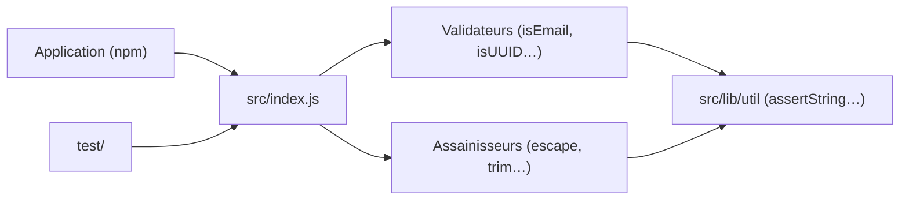

# validatorjs/validator.js

> Bibliothèque JavaScript de validateurs et d'assainisseurs de chaînes, pour serveur ou navigateur.

## Le problème
Valider e-mail, URL, dates, identifiants ou numéros à la main donne des expressions régulières fragiles.

## Ce que ça fait vraiment
Des dizaines de fonctions `isXxx(str, options)` (e-mail, URL, UUID, IBAN, carte bancaire, date, JSON, JWT, mot de passe fort, téléphone par pays…) et des assainisseurs (`escape`, `trim`, `normalizeEmail`, `toInt`…). Elle ne traite que des chaînes : tout autre type provoque une erreur. Imports ES6, CommonJS ou par fonction pour le tree-shaking. Le README précise que `matches` n'est pas protégé contre les attaques ReDoS et que l'assainissement XSS a été retiré.

## Comment c'est branché


## Essayer
```bash
npm i validator
```
```javascript
var validator = require('validator');
validator.isEmail('foo@bar.com'); //=> true
```

## Coût et pièges
Gratuit. Convertir les entrées en chaîne (`input + ''`). Ne pas laisser un utilisateur fournir un motif à `matches`.

## Ce que ce n'est pas
Ce n'est pas un validateur de schémas ni de types, ni une protection XSS.

## Alternatives
Pour le XSS, le README cite xss-filters de Yahoo et DOMPurify.

## Pour toi
Surveiller : utile seulement dans un service Node ; en Python, un validateur de schémas dédié sera plus adapté.

