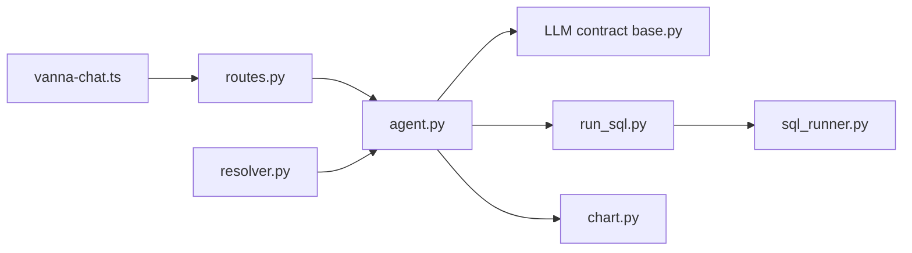

# vanna-ai/vanna

> Framework Python d'agents text-to-SQL respectant les droits utilisateur, avec composant web de chat.

## Le problème
Laisser des utilisateurs métier interroger une base en langage naturel sans exposer de données hors de leurs droits est difficile.

## Ce que ça fait vraiment
`Agent` orchestre LLM, outils et streaming ; `UserResolver` extrait l'identité de ta propre auth.
Outils permissionnés par groupes (`RunSqlTool`, outils custom) ; runners SQL pour SQLite, Postgres, Snowflake, BigQuery…
Streaming SSE de composants riches (tables, graphiques Plotly, résumés) vers le composant `<vanna-chat>`.
Hooks de cycle de vie, audit, observabilité ; adaptateur pour migrer depuis Vanna 0.x.

## Comment c'est branché

## Essayer
Aucune commande d'installation documentée ; seul un exemple de code FastAPI est fourni.

## Coût et pièges
Clé d'API LLM à ta charge (ou Ollama). Le filtrage par ligne dépend de ta propre implémentation côté runner.

## Ce que ce n'est pas
Dépôt archivé : plus de correctifs. La sécurité « row-level » n'est pas magique, elle repose sur ton code.

## Alternatives
Aucune alternative nommée dans le README.

## Pour toi
Surveiller : bonne architecture de référence pour un text-to-SQL respectant les droits, mais archivé — à ne pas intégrer comme dépendance durable.
