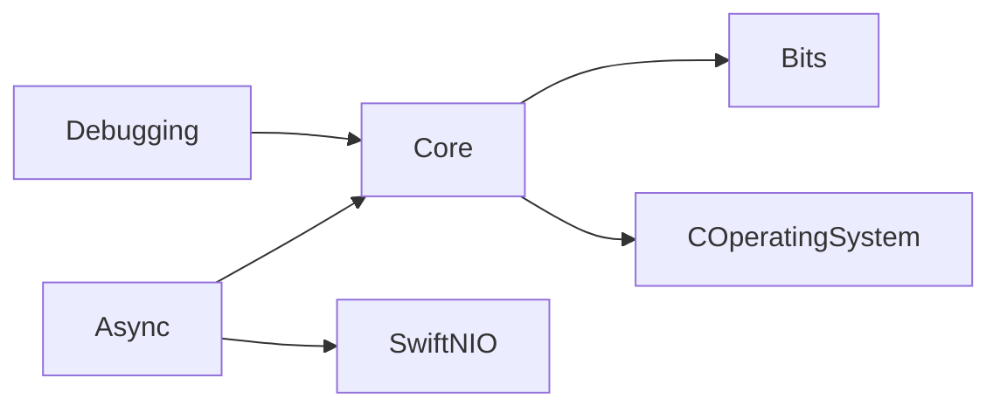

# vapor/core

> Ancien paquet Swift de base pour Vapor (async, octets, utilitaires système), archivé.

## Le problème
README vide : la fiche repose sur l'architecture déduite du code.

## Ce que ça fait vraiment
D'après le code : cinq modules Swift, `Async` (futures, workers, pont NIO), `Bits` (extensions d'octets), `COperatingSystem` (enveloppe libc), `Core` (fichiers, processus, réflexion, codeurs Base64/Hex) et `Debugging` (erreurs, `SourceLocation`).

## Comment c'est branché

## Essayer
Aucune commande documentée (README vide).

## Coût et pièges
Gratuit. Archivé, dernier push en septembre 2021.

## Ce que ce n'est pas
Pas maintenu, pas documenté ici, pas une application.

## Alternatives
Aucune nommée dans le README.

## Pour toi
Ignorer : archivé depuis 2021 et propre à Swift serveur, donc sans utilité pour un profil data, IA ou MLOps.

