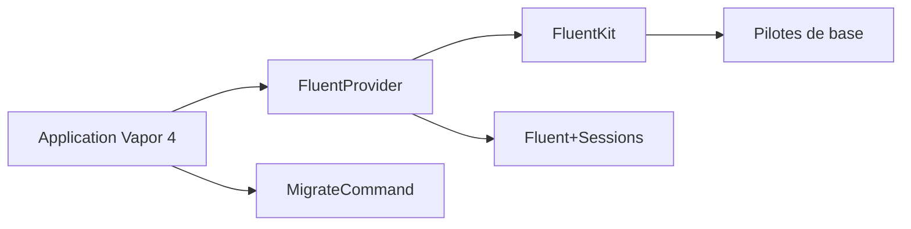

# vapor/fluent

> Pont entre le framework web Vapor (Swift) et la couche base de données FluentKit.

## Le problème
Brancher l'ORM FluentKit sur le cycle de vie d'une application Vapor demande du code de liaison.

## Ce que ça fait vraiment
Le README tient en deux phrases. Le code montre un `FluentProvider`, une commande de migration, des aides d'authentification (`ModelAuthenticatable`, jetons, identifiants), plus cache, historique, pagination et sessions, avec enrobages async/await.

## Comment c'est branché

## Essayer
Aucune commande documentée dans le README ; renvoi à la documentation Fluent.

## Coût et pièges
Rien de chiffré. Paquet Swift à déclarer dans `Package.swift` ; un pilote de base séparé est nécessaire (non documenté ici).

## Ce que ce n'est pas
Ce n'est pas l'ORM lui-même (c'est FluentKit) ni un pilote de base de données.

## Alternatives
Aucune alternative nommée dans le README.

## Pour toi
Ignorer : brique Swift côté serveur, sans lien avec un flux data, IA ou MLOps, et README quasi vide.

