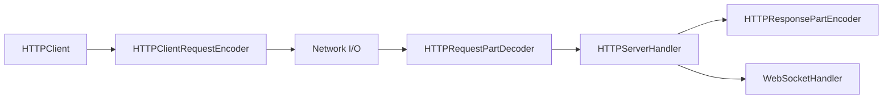

# vapor/http

> Ancienne bibliothèque Swift de client et serveur HTTP et WebSocket sur SwiftNIO, aujourd'hui archivée.

## Le problème
README vide : la fiche repose sur l'architecture déduite du code, sans texte de l'auteur.

## Ce que ça fait vraiment
D'après le code : module « HTTPKit » avec `HTTPClient` et `HTTPServer` bâtis en chaîne de handlers SwiftNIO (encodeurs, décodeurs, upgrade), modèles partagés `HTTPRequest`/`HTTPResponse`/`HTTPHeaders`, et support WebSocket par upgrade.

## Comment c'est branché

## Essayer
Aucune commande documentée (README vide).

## Coût et pièges
Gratuit. Archivé, dernier push en octobre 2021, 22 issues ouvertes : aucun support.

## Ce que ce n'est pas
Pas maintenu, pas documenté, pas une application exécutable.

## Alternatives
Aucune nommée dans le README.

## Pour toi
Ignorer : archivé depuis 2021, sans documentation, et sans lien avec un travail data, IA ou MLOps.

