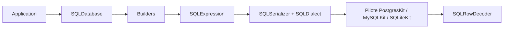

# vapor/sql-kit

> Bibliothèque Swift pour construire et sérialiser des requêtes SQL, indépendante du dialecte, pour développeurs Swift/Vapor.

## Le problème
Écrire du SQL en chaînes à la main est fragile et diffère selon Postgres, MySQL ou SQLite.

## Ce que ça fait vraiment
Fournit des constructeurs fluents (`select`, `insert`, `update`, `delete`, `create table`) qui produisent un arbre `SQLExpression`, sérialisé par `SQLSerializer` selon le `SQLDialect`. Les valeurs sont liées comme paramètres. Ne gère pas les connexions : il faut un pilote (PostgresKit, MySQLKit, SQLiteKit) qui implémente `SQLDatabase`. Décodage des lignes en `Codable`.

## Comment c'est branché


## Essayer
```bash
# Package.swift
.package(url: "https://github.com/vapor/sql-kit.git", from: "3.0.0")
```

## Coût et pièges
Gratuit. Exige SwiftNIO 2.x et un pilote de base à part. Pour l'entrée utilisateur, utiliser `\(bind:)` et non l'interpolation brute.

## Ce que ce n'est pas
Ni un ORM ni un pilote de base. Le README déconseille les requêtes `raw` au profit des builders.

## Alternatives
- PostgresKit, MySQLKit, SQLiteKit : les pilotes à ajouter, pas des concurrents.

## Pour toi
Ignorer : outil de l'écosystème Swift serveur, hors de la pile Python/SQL d'un profil data ou MLOps.

