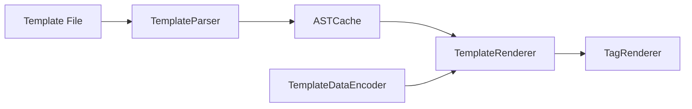

# vapor/template-kit

> Ancienne bibliothèque Swift de rendu de gabarits (base de Leaf), archivée.

## Le problème
README vide : la fiche repose sur l'architecture déduite du code.

## Ce que ça fait vraiment
D'après le code : `TemplateByteScanner` et `TemplateParser` produisent un AST, `TemplateDataEncoder` convertit les données Swift en `TemplateData`, `TemplateRenderer` parcourt l'AST et appelle les `TagRenderer` (Var, If, etc.), `ASTCache` garde les AST analysés.

## Comment c'est branché

## Essayer
Aucune commande documentée (README vide).

## Coût et pièges
Gratuit. Archivé, dernier push en mars 2020.

## Ce que ce n'est pas
Pas maintenu ni documenté ici ; pas un moteur de gabarits général hors Swift.

## Alternatives
Aucune nommée dans le README.

## Pour toi
Ignorer : archivé depuis 2020, propre à Swift serveur, sans usage pour un profil data, IA ou MLOps.

