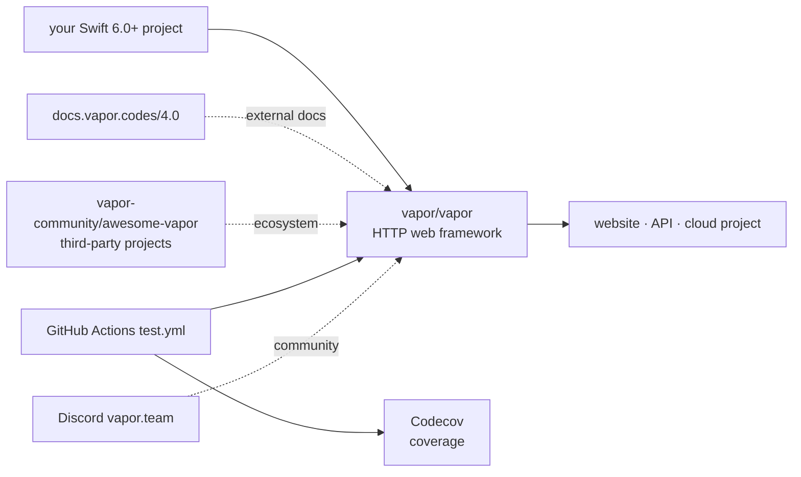

# vapor/vapor

> **An HTTP web framework in Swift, for anyone writing a site, an API or a server-side service.**

## The problem

Writing an HTTP server in Swift without a framework means rewiring the socket listener,
request parsing, routing and response serialisation by hand. And for a team already fluent in
Swift on the client side, the usual alternative is to switch language on the server.

## What it actually does

The README is almost entirely badges, sponsor logos and backer avatars: the descriptive
material fits in one sentence. What it actually states:

- Vapor is an **HTTP web framework for Swift**, aimed at a website, an API or a "cloud" project.
- It targets **Swift 6.0 and above** (the `swift60up` badge).
- Documentation lives outside the repository, at `docs.vapor.codes/4.0/` — so version 4.
- A separate directory of third-party projects exists: `vapor-community/awesome-vapor`.
- The repository runs GitHub Actions CI (`test.yml`) with coverage tracked on Codecov.

The README documents **no API, no routing, no internal layering and not a single code sample**.
Everything below is either traceable to those points or flagged as undocumented.

## How it is wired

No code-derived diagram exists for this repository, and the README describes no architecture.
The diagram below is restricted to what the README names — it is not an internal view of the
framework, for lack of material.



## Trying it

```bash
# The README documents no install, build or run command:
# no SwiftPM line, no "vapor new", no runnable example.
# It defers getting started to the external documentation:
#   https://docs.vapor.codes/4.0/
```

Nothing is reconstructed here on purpose: inventing a `swift package` line or a dependency
declaration would be a claim with no backing in the README.

## Cost and gotchas

- **Free**: open source under the MIT licence (README badge), no account, no API key, no
  third-party service needed to use it.
- Funding runs through **GitHub Sponsors and Open Collective** (sponsors and backers listed in
  the README) — a donation model, with no commercial edition declared.
- **A real prerequisite the sheet's vocabulary cannot express**: a **Swift 6.0 or later**
  toolchain, hence a properly set up macOS or Linux box. This is not a `pip install`.
- **The real cost is documentary**: everything needed to start lives outside the repository.
  With the README alone, you cannot write a single line of code.
- Hosting and operation stay on you: the README mentions no managed offering.

## What it is not

- **Not a ready-to-run tool**: it is a dependency to compile into a Swift project, not a binary
  or a service you start.
- **Not documented in the repository**: the README is a landing page plus sponsor credits.
  Judging the project on that file alone would be a mistake — hence the `insufficient material`
  flag, which is about this sheet, not about the framework's quality.
- **Not a data or AI environment**: nothing in the README mentions data processing, inference
  or Python interoperability.

## Alternatives

| | When to prefer it |
|---|---|
| **hummingbird-project/hummingbird** | The other Swift HTTP framework in the catalogue. Worth a look for a lighter base; Vapor's README does not name it, so the comparison is yours to make. |
| **vapor/http** | The same publisher's HTTP component: one layer down, if you want the transport without the full framework. |
| **httpswift/swifter** | A minimal Swift HTTP server, suited to a one-off need or an embedded test server rather than an application API. |

`SwiftyBeaver/SwiftyBeaver` (logging) is a lexical neighbour, not an alternative.

## For you

For a data / AI / MLOps profile, walk past it for now: the data and model toolchain lives in
Python, and nothing here plugs into it. Keep it on the watch list only if your organisation
already ships Swift on the client and wants one language across the back end too.
