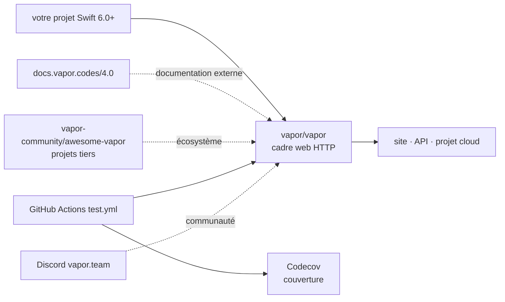

# vapor/vapor

> **Cadre web HTTP en Swift, pour qui écrit un site, une API ou un service côté serveur.**

## Le problème

Écrire un serveur HTTP en Swift sans cadre suppose de recâbler soi-même l'écoute réseau, le
découpage des requêtes, le routage et la sérialisation des réponses. Et pour une équipe déjà
outillée en Swift côté client, la seule alternative courante est de changer de langage côté
serveur.

## Ce que ça fait vraiment

Le README est ici presque entièrement fait de badges, de logos de sponsors et de vignettes de
soutiens : la matière descriptive tient en une phrase. Ce qui y est réellement affirmé :

- Vapor est un **cadre web HTTP pour Swift**, destiné à un site, une API ou un projet dit
  « cloud ».
- Il vise **Swift 6.0 et au-delà** (badge `swift60up`).
- La documentation vit hors du dépôt, sur `docs.vapor.codes/4.0/` — donc en version 4.
- Un annuaire de projets tiers existe séparément : `vapor-community/awesome-vapor`.
- Le dépôt affiche une intégration continue GitHub Actions (`test.yml`) et une couverture de
  code suivie via Codecov.

Le README ne documente **ni l'API, ni le routage, ni les couches internes, ni un seul exemple
de code**. Tout le reste de ce qui suit est donc soit tracé à ces éléments, soit signalé comme
non documenté.

## Comment c'est branché

Aucun diagramme tiré du code n'existe pour ce dépôt, et le README ne décrit aucune
architecture. Le schéma ci-dessous se limite strictement aux éléments nommés dans le README —
ce n'est pas une vue interne du cadre, faute de matière.



## Essayer

```bash
# Le README ne documente aucune commande d'installation, de build ni de démarrage :
# ni SwiftPM, ni « vapor new », ni exemple exécutable.
# Il renvoie la prise en main à la documentation externe :
#   https://docs.vapor.codes/4.0/
```

Rien n'est reconstruit ici volontairement : inventer une ligne `swift package` ou une
déclaration de dépendance serait une affirmation non traçable au README.

## Coût et pièges

- **Gratuit** : projet open source sous licence MIT (badge du README), aucun compte, aucune
  clé d'API, aucun service tiers requis pour l'utiliser.
- Le financement passe par **GitHub Sponsors et Open Collective** (sponsors et soutiens listés
  au README) — modèle de dons, pas d'édition commerciale déclarée.
- **Prérequis réel non listable dans le schéma de la fiche** : une chaîne d'outils **Swift 6.0
  ou supérieur**, donc macOS ou Linux correctement outillé. Ce n'est pas un `pip install`.
- **Le vrai coût est documentaire** : tout ce qu'il faut savoir pour démarrer est hors dépôt.
  Sans accès à `docs.vapor.codes`, le README seul ne permet pas d'écrire une ligne de code.
- Hébergement et exécution restent à votre charge : le README ne mentionne aucune offre gérée.

## Ce que ce n'est pas

- **Ce n'est pas un outil prêt à lancer** : c'est une dépendance à compiler dans un projet
  Swift, pas un binaire ni un service que l'on démarre.
- **Ce n'est pas documenté dans le dépôt** : le README est une page de présentation et de
  remerciements aux sponsors. Juger le projet sur ce fichier seul serait une erreur — d'où
  l'alerte `matière insuffisante`, qui porte sur la fiche, pas sur la qualité du cadre.
- **Ce n'est pas un environnement pour la donnée ou l'IA** : rien dans le README n'évoque de
  traitement de données, d'inférence ou d'interopérabilité Python.

## Alternatives

| | Quand le préférer |
|---|---|
| **hummingbird-project/hummingbird** | Autre cadre HTTP Swift du catalogue. À regarder si l'on cherche une base plus légère ; le README de Vapor ne le nomme pas, la comparaison reste donc à faire soi-même. |
| **vapor/http** | Composant HTTP du même éditeur : le niveau en dessous, si l'on veut le transport sans le cadre complet. |
| **httpswift/swifter** | Serveur HTTP Swift minimal, pertinent pour un besoin ponctuel ou un serveur embarqué de test plutôt que pour une API applicative. |

`SwiftyBeaver/SwiftyBeaver` (journalisation) est un voisin de lexique, pas une alternative.

## Pour toi

Pour un profil data / IA / MLOps, passer son chemin dans l'immédiat : l'outillage de la donnée
et du modèle vit en Python, et rien dans ce dépôt ne s'y raccorde. À garder sous surveillance
seulement si votre organisation produit déjà du Swift côté client et veut mutualiser le
langage sur son back-end.
