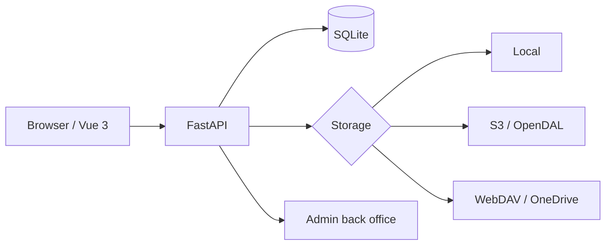

# vastsa/FileCodeBox

> **Self-hosted file sharing behind a pickup code.** Drop a file, get a code, the other side types it in.

## The problem

Sending a file or a snippet of text to someone usually means an account, a third-party service and
data sitting on a host you did not pick. The README describes the opposite: no sign-up, a pickup
code, and the instance running on your own machine.

## What it actually does

The README states that files **and** text are shared through the same flow, with drag and drop,
paste, batch uploads and chunked uploads. Expiry is set by time, by number of pickups, or set to
permanent, and expired content is cleaned up automatically. Storage is configurable: local, S3,
OneDrive, WebDAV and OpenDAL, so the data stays on the operator's own infrastructure. Screenshots
show a send page and an admin area (admin login, file management, system settings). A first-run
initialisation step is required on first access.

## How it is wired

No code-derived diagram exists for this repository; the graph below only restates the stack and
the building blocks named in the README.



The front end lives in a separate repository, `vastsa/FileCodeBoxFronted` (the current "2024" theme).

## Trying it

```bash
docker run -d --restart unless-stopped \
  -p 12345:12345 \
  -v ./data:/app/data \
  -e APP_ENV=production \
  -e LOG_LEVEL=warning \
  --log-opt max-size=10m \
  --log-opt max-file=3 \
  --name filecodebox \
  lanol/filecodebox:2.7.1 # x-release-please-version
```

Then open `http://localhost:12345` and run the initialisation. The README advises pinning the
version number in production; `latest` tracks the newest stable release.

## Cost and gotchas

The code is free and Docker is the only documented install prerequisite. The real cost is hosting:
an exposed port, a `./data` volume to back up, and the object-storage bill if you wire in S3,
OneDrive or WebDAV — accounts and quotas are on you. The detailed documentation (getting started,
storage, security, API) lives on an external site, `fcb-docs.aiuo.net`; none of it is spelled out
in the README. The README also states that responsibility for uploaded content and for compliance
rests with whoever runs the instance.

## What it is not

It is not synced cloud storage and not a Nextcloud: the README describes transfer by code with
expiry, not a durable file space. It is not a library to embed either — it is an application you
deploy, with an admin console. And "no registration" applies to the recipient: the instance itself
has an administrator account. Security settings (rate limiting, sessions, access protection) exist
but are deferred to the external documentation.

## Alternatives

No comparable alternative in the catalogue: among the suggested neighbours, `fastapi/fastapi` is
the framework this project is built on rather than a competitor, while `polarsource/polar`,
`prettier/prettier` and `OWASP/Nest` address other needs. The README names only a sibling project
by the same author, `vastsa/BokeBox` (AI podcasts), which is not a substitute.

## Why it matters to you

More useful for team logistics than for a data stack: an internal instance to move a dataset, an
export or a dump around without a third-party service. Worth watching if you want file exchanges to
stay on your own infrastructure; the LGPL-3.0 licence and the apparently single-author maintenance
are the two things to weigh before depending on it.
