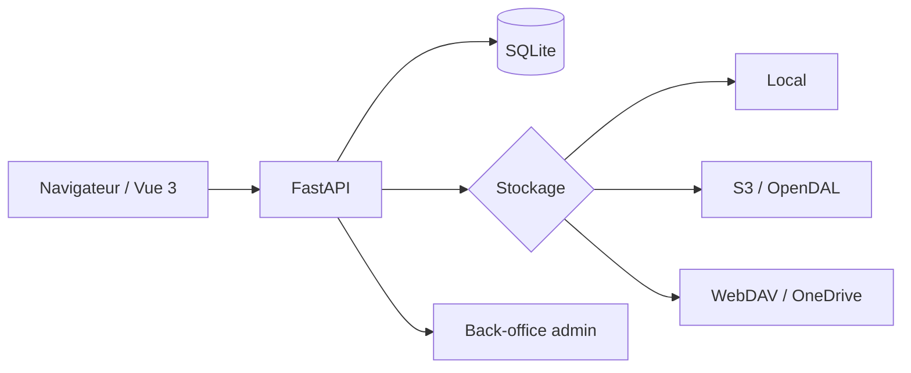

# vastsa/FileCodeBox

> **Partage de fichiers auto-hébergé par code de retrait.** On dépose, on obtient un code, l'autre le saisit.

## Le problème

Envoyer un fichier ou un bout de texte à quelqu'un impose en général un compte, un service tiers
et des données qui partent chez un hébergeur qu'on ne choisit pas. Le README décrit l'inverse :
pas d'inscription, un code de retrait, et l'instance chez soi.

## Ce que ça fait vraiment

Le README annonce le partage unifié de fichiers **et** de texte, avec glisser-déposer, collage,
envoi par lot et upload découpé en morceaux. L'expiration se règle par durée, par nombre de
retraits ou en conservation permanente, et le contenu expiré est nettoyé automatiquement.
Le stockage est configurable : local, S3, OneDrive, WebDAV et OpenDAL — les données restent sur
l'infrastructure de l'utilisateur. Des captures montrent une page d'envoi et un back-office
(connexion admin, gestion des fichiers, réglages système). Une première initialisation est
demandée au premier accès.

## Comment c'est branché

Aucun diagramme tiré du code n'est disponible pour ce dépôt ; le schéma ci-dessous reprend
uniquement la pile et les briques nommées dans le README.



Le front-end est dans un dépôt séparé, `vastsa/FileCodeBoxFronted` (thème « 2024 » courant).

## Essayer

```bash
docker run -d --restart unless-stopped \
  -p 12345:12345 \
  -v ./data:/app/data \
  -e APP_ENV=production \
  -e LOG_LEVEL=warning \
  --log-opt max-size=10m \
  --log-opt max-file=3 \
  --name filecodebox \
  lanol/filecodebox:2.7.1 # x-release-please-version
```

Puis ouvrir `http://localhost:12345` et faire l'initialisation. Le README recommande de figer
le numéro de version en production ; `latest` pointe sur la dernière version stable.

## Coût et pièges

Le code est gratuit et la seule dépendance d'installation documentée est Docker. Le coût réel
est celui de l'hébergement : un port exposé, un volume `./data` à sauvegarder, et la facture du
stockage objet si l'on branche S3, OneDrive ou WebDAV — comptes et quotas à ta charge. La doc
détaillée (démarrage, stockage, sécurité, API) vit sur un site externe, `fcb-docs.aiuo.net` :
rien d'essentiel n'est expliqué dans le README lui-même. Le README rappelle enfin que la
responsabilité du contenu déposé et de la conformité revient à l'exploitant.

## Ce que ce n'est pas

Ce n'est pas un stockage cloud synchronisé ni un Nextcloud : le README décrit un transit par
code, avec expiration, pas un espace de fichiers durable. Ce n'est pas non plus une bibliothèque
à intégrer — c'est une application à déployer, avec un back-office. Et « sans inscription » vaut
pour le destinataire : l'instance, elle, a un compte administrateur. Les réglages de sécurité
(limitation de débit, sessions, protection d'accès) existent mais sont renvoyés à la doc externe.

## Alternatives

Aucune alternative comparable dans le catalogue : parmi les voisins proposés, `fastapi/fastapi`
est le framework sur lequel repose ce projet et non un concurrent, et `polarsource/polar`,
`prettier/prettier` ou `OWASP/Nest` répondent à d'autres besoins. Le README ne cite qu'un projet
parent du même auteur, `vastsa/BokeBox` (podcasts IA), qui n'est pas un substitut.

## Pour toi

Utile pour la logistique d'équipe plus que pour la pile data : une instance interne pour faire
circuler un jeu de données, un export ou un dump sans passer par un service tiers. À surveiller
si tu tiens à garder les échanges de fichiers sur ton infra ; la licence LGPL-3.0 et le fait que
le projet semble porté par une personne sont les deux points à peser avant d'en dépendre.
