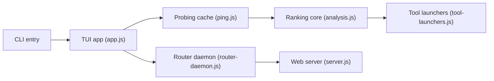

# vava-nessa/free-coding-models

> Tableau de bord terminal qui classe en direct les modèles de code gratuits et les branche dans ton outil.

## Le problème
Il existe beaucoup de modèles gratuits chez de nombreux fournisseurs ; lequel est rapide et stable maintenant ?

## Ce que ça fait vraiment
Sonde en parallèle 256 modèles de 24 fournisseurs, calcule un score de stabilité (p95, gigue, pics, disponibilité) et un palier basé sur SWE-bench Verified. Un Entrée écrit le modèle choisi dans la config d'OpenCode, Goose, Aider, etc. Un démon local compatible OpenAI (port 19280) fait du basculement automatique.

## Comment c'est branché


## Essayer
```bash
npm install -g free-coding-models
free-coding-models --help
free-coding-models --daemon-bg
```

## Coût et pièges
Gratuit, mais il faut un compte et une clé chez au moins un fournisseur (Groq, Cerebras, NVIDIA NIM). Les sondes consomment du quota. Télémétrie anonyme active par défaut (`--no-telemetry`).

## Ce que ce n'est pas
Ce n'est pas un modèle ni un hébergeur. « Gratuit » vaut pour un couple fournisseur/modèle et peut changer. Licence non identifiée par GitHub (le README annonce MIT).

## Alternatives
Aucune alternative nommée dans le README.

## Pour toi
À surveiller : pratique pour choisir un modèle gratuit à brancher dans un agent de code, mais dépend de quotas fournisseurs instables.
