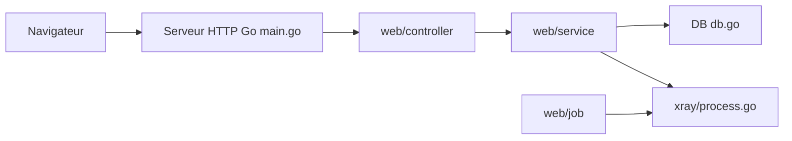

# vaxilu/x-ui

> Panneau web pour gérer un serveur proxy Xray multi-utilisateurs et multi-protocoles, pour administrateurs de serveurs.

## Le problème
Configurer Xray à la main (protocoles, utilisateurs, quotas de trafic, certificats) est fastidieux sans interface.

## Ce que ça fait vraiment
Application Go monolithique avec interface web : surveillance système, comptes multi-utilisateurs, protocoles vmess, vless, trojan, shadowsocks, etc., limites de trafic et d'expiration, modèle de configuration Xray, HTTPS avec certificat obtenu via l'API DNS Cloudflare et Let's Encrypt. Les données sont locales (SQLite supposée). Le pilotage du binaire Xray est un sous-processus. Notifications Telegram annoncées « en développement ». Le README est en chinois.

## Comment c'est branché


## Essayer
```bash
bash <(curl -Ls https://raw.githubusercontent.com/vaxilu/x-ui/master/install.sh)
docker build -t x-ui .
```

## Coût et pièges
Gratuit. Le script d'installation est exécuté en root depuis Internet. Dernier push en août 2024 : pas de suivi de sécurité visible. Le README avertit qu'il ferme les tickets de débutants.

## Ce que ce n'est pas
Ce n'est pas un VPN clé en main ni un outil documenté pour l'entreprise ; l'usage légal dépend de ton pays.

## Alternatives
Le README mentionne v2-ui, dont il permet la migration.

## Pour toi
À ignorer : hors du champ data/IA, non maintenu depuis plus d'un an et lancé en root avec un script distant.

