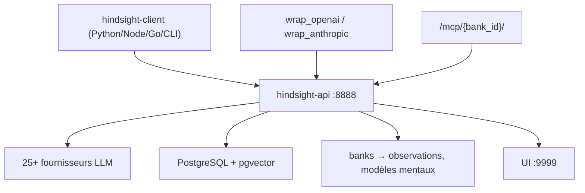

# vectorize-io/hindsight

> Système de mémoire pour agents, orienté apprentissage durable plutôt que rappel de conversation.

## Le problème
Un agent qui ne retient que l'historique de dialogue répète ses erreurs : il se souvient de ce qui
a été dit, pas de ce qu'il a compris.

## Ce que ça fait vraiment
Trois opérations : `retain` (extraction de faits, entités, relations, données temporelles),
`recall` (quatre stratégies en parallèle — sémantique, BM25, graphe, temporelle — fusionnées par
reciprocal rank fusion puis reclassées par cross-encoder), `reflect` (analyse approfondie).
Quatre types de mémoire : faits du monde, expériences, observations consolidées avec citations et
compteur de preuves, modèles mentaux (réponses permanentes réécrites en arrière-plan). Les mémoires
vivent dans des *banks* étanches. Un endpoint MCP est exposé par bank.

## Comment c'est branché


## Essayer
```bash
docker run -it --pull always --name hindsight --restart unless-stopped -p 8888:8888 -p 9999:9999 \
  -e HINDSIGHT_API_LLM_API_KEY=$OPENAI_API_KEY \
  -v hindsight-data:/home/hindsight/.pg0 \
  ghcr.io/vectorize-io/hindsight:latest
pip install hindsight-client -U
pip install hindsight-all -U
```

## Coût et pièges
Chaque `retain` déclenche un appel LLM d'extraction : la facture suit le volume ingéré, pas le
volume interrogé. Auto-hébergé, il faut PostgreSQL + pgvector (ou Oracle 23ai). Hindsight Cloud est
facturé à l'usage. Sur Mac Intel, il faut `hindsight-all-slim` au lieu de `hindsight-all`.

## Ce que ce n'est pas
Pas un simple magasin vectoriel : le README le dit, c'est surdimensionné pour un flux n8n simple.
Les scores de benchmark des concurrents sont auto-déclarés par leurs éditeurs, seul celui de
Hindsight est présenté comme reproduit par des tiers. Memory Defense (scan de secrets/PII) est
optionnel et désactivé par défaut.

## Alternatives
- RAG et graphes de connaissances : les deux techniques que le README revendique de dépasser.
- Hindsight Cloud : la version gérée, si tu ne veux pas exploiter le serveur.

## Pour toi
Le candidat le plus documenté de la catégorie mémoire d'agent — à tester sur une bank jetable avant tout engagement.
