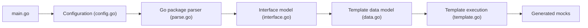

# vektra/mockery

> Générateur de mocks pour interfaces Go, basé sur testify/mock, pour développeurs Go.

## Le problème
Écrire à la main les mocks d'interfaces Go pour les tests unitaires est répétitif.

## Ce que ça fait vraiment
Charge la configuration, découvre les paquets et interfaces configurés, construit des données typées, applique des gabarits (locaux ou distants) et écrit les fichiers de mocks. Les commandes `init`, `migrate` et `showconfig` gèrent la configuration. Le README est très bref et renvoie à un site GitHub Pages pour la documentation ; l'installation n'y est pas décrite.

## Comment c'est branché


## Essayer
```bash
go mod download -x
task test
```
(Commandes de développement du README, pas d'usage.)

## Coût et pièges
Gratuit. L'usage réel est dans la documentation externe, non couverte ici.

## Ce que ce n'est pas
Pas un framework de test : il produit seulement du code de mock pour testify.

## Alternatives
Aucune alternative nommée dans le README.

## Pour toi
À ignorer : utile seulement si tu écris du Go avec testify ; ton stack data/IA est surtout Python.

