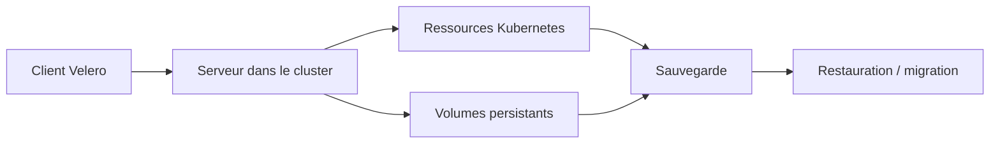

# velero-io/velero

> Sauvegarde, restauration et migration des ressources et volumes d'un cluster Kubernetes.

## Le problème
Un cluster Kubernetes perdu emporte ses objets et ses volumes persistants ; recréer l'état d'une
production, ou la répliquer vers un cluster de test, n'a pas de solution native.

## Ce que ça fait vraiment
Sauvegarde les ressources du cluster et les volumes persistants, puis les restaure en cas de perte.
Sert aussi à migrer des ressources vers un autre cluster, ou à répliquer la production vers des
environnements de développement et de test. Deux composants : un serveur qui tourne dans le cluster
et un client en ligne de commande local. Anciennement Heptio Ark, projet **sandbox** de la CNCF.

## Comment c'est branché

## Essayer
Aucune commande n'est donnée dans ce README ; il renvoie vers https://velero.io/docs/ pour le guide
de démarrage et la construction depuis les sources.

## Coût et pièges
Gratuit, mais la destination des sauvegardes (stockage objet cloud ou sur site) se facture séparément.
Compatibilité : Velero 1.14 à 1.18 visent Kubernetes 1.18 et plus, testés sur un sous-ensemble de versions
seulement — le projet recommande de tester votre combinaison avant d'installer ou de mettre à niveau.

## Ce que ce n'est pas
Pas une garantie de restauration sur toute combinaison de versions : le tableau de compatibilité ne couvre
que ce qui est effectivement testé. Le chemin de mise à niveau n'est vérifié que sur n-2 versions mineures.
Statut sandbox CNCF, pas diplômé.

## Alternatives
Aucun dépôt alternatif n'est nommé dans le README.

## Pour toi
Indispensable dès que des modèles ou des bases vivent dans des PVC que tu ne veux pas perdre.
